# Lab 01 — Gestión de identidades en Microsoft Entra ID

> Fase: F2 | Cert: AZ-104 | Lab: 01 | Tipo: base

---

**Módulo:** Administrar identidades y gobernanza (20–25%)
**Duración estimada:** 30 minutos
**Costo real documentado:** $0.00 — sin recursos de compute
**Región:** N/A — Entra ID es un servicio global
**Fuente oficial:** [LAB_01 — MicrosoftLearning](https://microsoftlearning.github.io/AZ-104-MicrosoftAzureAdministrator/Instructions/Labs/LAB_01-Manage_Entra_ID_Identities.html)

---

## Índice

- [Objetivos](#objetivos)
- [Prerequisitos](#prerequisitos)
- [Servicios utilizados](#servicios-utilizados)
- [Arquitectura del lab](#arquitectura-del-lab)
- [Tarea 1 — Crear y configurar cuentas de usuario](#tarea-1--crear-y-configurar-cuentas-de-usuario)
- [Tarea 2 — Crear grupos y añadir miembros](#tarea-2--crear-grupos-y-añadir-miembros)
- [Errores comunes](#errores-comunes)
- [Limpieza de recursos](#limpieza-de-recursos)
- [Costo real documentado](#costo-real-documentado)
- [Resumen y siguiente lab](#resumen-y-siguiente-lab)

---

## Objetivos

Al completar este lab serás capaz de:

- [ ] Crear y configurar cuentas de usuario internas en Microsoft Entra ID
- [ ] Invitar usuarios externos (B2B guest accounts)
- [ ] Crear grupos de seguridad con membresía asignada estáticamente
- [ ] Diferenciar entre membresía estática y dinámica (y cuándo requiere licencia Premium)

**Dominios del examen AZ-104 que cubre este lab:**
> Manage Azure identities and governance (20–25%)
> — Manage Microsoft Entra users and groups

---

## Prerequisitos

**Labs anteriores requeridos:** ninguno — primer lab de la serie.

**Acceso necesario:**
- Suscripción Azure activa con rol mínimo **User Administrator** en Entra ID
- Cuenta de correo accesible para el ejercicio de usuario invitado B2B

**Nota sobre licencias:** la membresía dinámica de grupos requiere **Entra ID Premium P1 o P2**.
Con suscripción Free o Pay-As-You-Go básica el dropdown solo mostrará "Assigned". Es comportamiento esperado, no error.

---

## Servicios utilizados

| Servicio | Propósito | Costo |
|----------|-----------|-------|
| Microsoft Entra ID (Free tier) | Directorio: usuarios y grupos | $0.00 |
| Entra ID Premium P1/P2 | Solo para membresía dinámica | [VERIFICAR COSTO] si se activa trial |

---

## Arquitectura del lab

```
Tenant de Microsoft Entra ID
│
├── Usuarios internos
│   └── az104-user1  (Job: IT Lab Administrator · Dept: IT · Location: US)
│
├── Usuarios invitados B2B
│   └── <email-externo>#EXT#@<tenant>.onmicrosoft.com
│
└── Grupos de seguridad
    └── IT Lab Administrators  (Membership: Assigned)
        ├── Owner: cuenta administradora
        ├── Member: az104-user1
        └── Member: usuario guest
```

Esta estructura es la base de RBAC que se aplica desde el Lab-02a en adelante.

---

## Tarea 1 — Crear y configurar cuentas de usuario

### 1.1 — Exploración inicial del tenant

**Portal**

1. Accede a [portal.azure.com](https://portal.azure.com).

2. Busca y selecciona **Microsoft Entra ID** en la barra de búsqueda superior.

   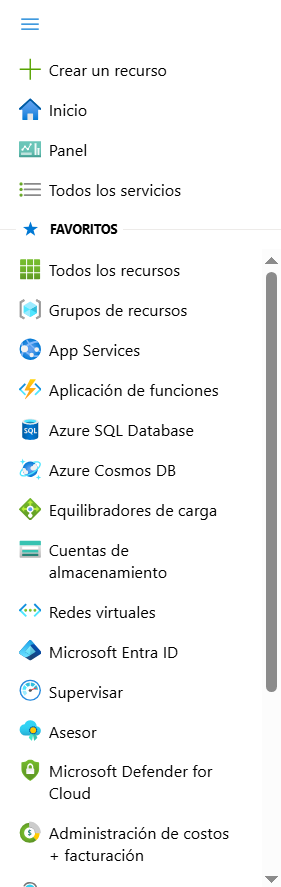

   > Un tenant es la instancia aislada de Entra ID de tu organización. Puedes tener
   > múltiples tenants (producción, dev, testing) y cambiar entre ellos con el botón **Switch**.

3. En el blade **Overview**, selecciona la pestaña **Manage tenants**.
4. Vuelve a **Entra ID** desde el breadcrumb.
5. Explora **Licenses** y **Password reset** en el panel izquierdo.

---

### 1.2 — Crear usuario interno

**Portal**

1. En el panel **Manage**, selecciona **Users**.

   

2. En el desplegable **New user**, selecciona **Create new user**.

   

3. Pestaña **Basics**:

   | Campo | Valor |
   |-------|-------|
   | User principal name | `az104-user1` |
   | Display name | `az104-user1` |
   | Auto-generate password | ✅ |
   | Account enabled | ✅ |

   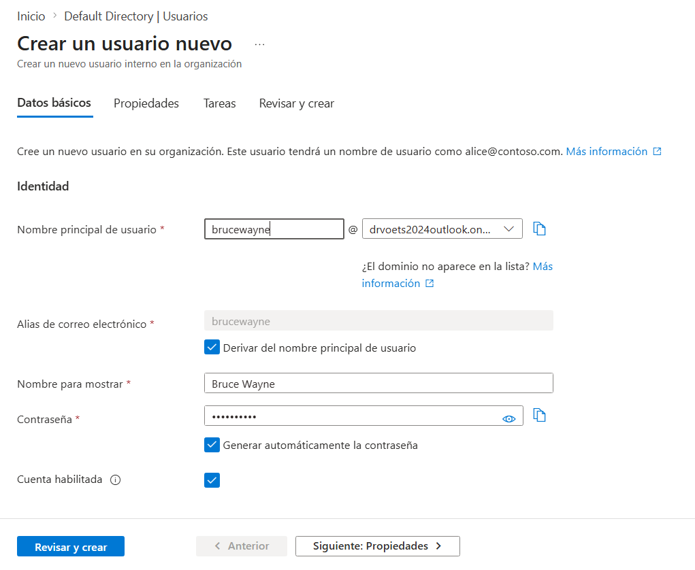

4. Pestaña **Properties**:

   | Campo | Valor |
   |-------|-------|
   | Job title | `IT Lab Administrator` |
   | Department | `IT` |
   | Usage location | **United States** |

   > `Usage location` es obligatorio para asignar licencias Microsoft 365 o Entra ID Premium.
   > Sin este campo, la asignación de licencias falla. Aparece con frecuencia en el examen.

   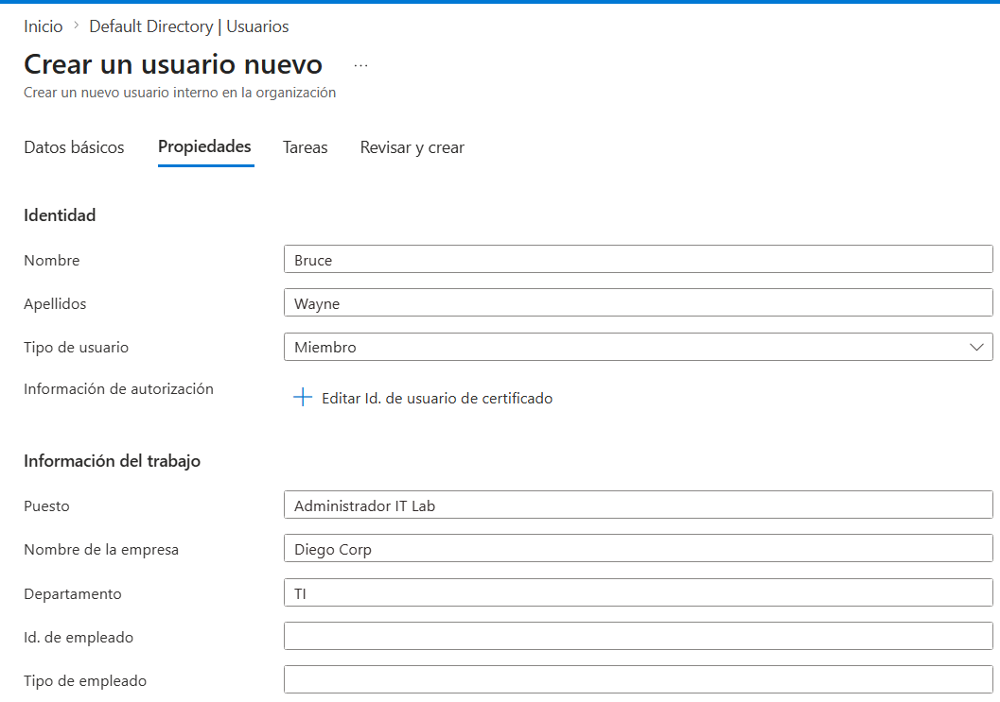

5. **Review + create** → **Create**.

   

6. Refresca y confirma que `az104-user1` aparece en la lista.

   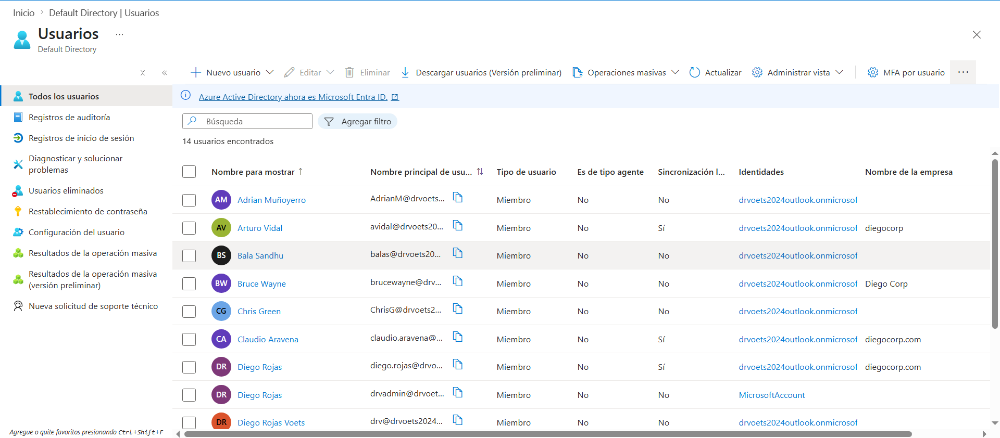

**Azure CLI**

```bash
# Obtener dominio del tenant desde el usuario activo
DOMAIN=$(az ad signed-in-user show --query userPrincipalName -o tsv | cut -d@ -f2)

# Crear usuario con contraseña temporal
az ad user create \
  --display-name "az104-user1" \
  --user-principal-name "az104-user1@${DOMAIN}" \
  --password "TempPass123!" \
  --force-change-password-next-sign-in true \
  --job-title "IT Lab Administrator" \
  --department "IT" \
  --usage-location "US"

# Verificar creación
az ad user show \
  --id "az104-user1@${DOMAIN}" \
  --query "{UPN:userPrincipalName, JobTitle:jobTitle, Dept:department}"
```

**PowerShell (Microsoft Graph)**

```powershell
Connect-MgGraph -Scopes "User.ReadWrite.All"

$passwordProfile = @{
    forceChangePasswordNextSignIn = $true
    password = "TempPass123!"
}

New-MgUser `
  -DisplayName "az104-user1" `
  -UserPrincipalName "az104-user1@<tu-dominio>.onmicrosoft.com" `
  -PasswordProfile $passwordProfile `
  -AccountEnabled `
  -JobTitle "IT Lab Administrator" `
  -Department "IT" `
  -UsageLocation "US"
```

**Resultado esperado:** `az104-user1` en Users → All users con estado *Enabled*.

---

### 1.3 — Invitar usuario externo (B2B)

**Portal**

1. Desplegable **New user** → **Invite an external user**.

   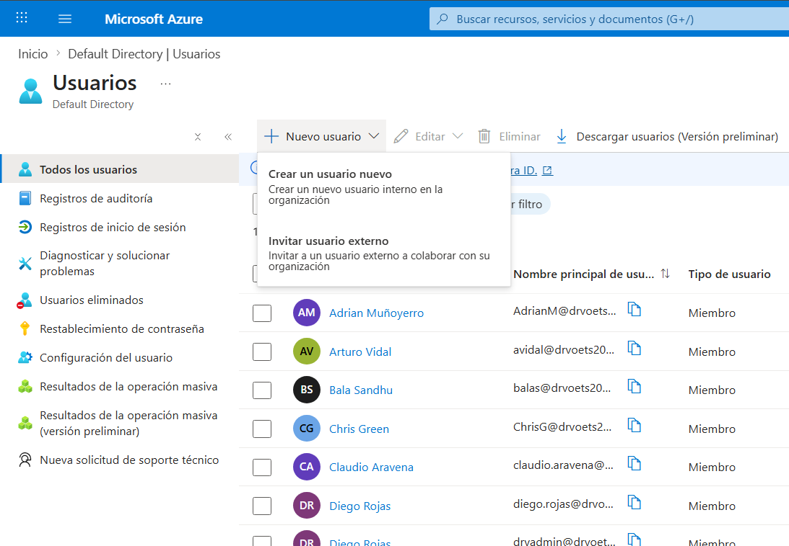

2. Pestaña **Basics**, configura:

   | Campo | Valor |
   |-------|-------|
   | Email | tu dirección de correo externa |
   | Display name | tu nombre |
   | Send invite message | ✅ |
   | Message | `Welcome to Azure and our group project` |

   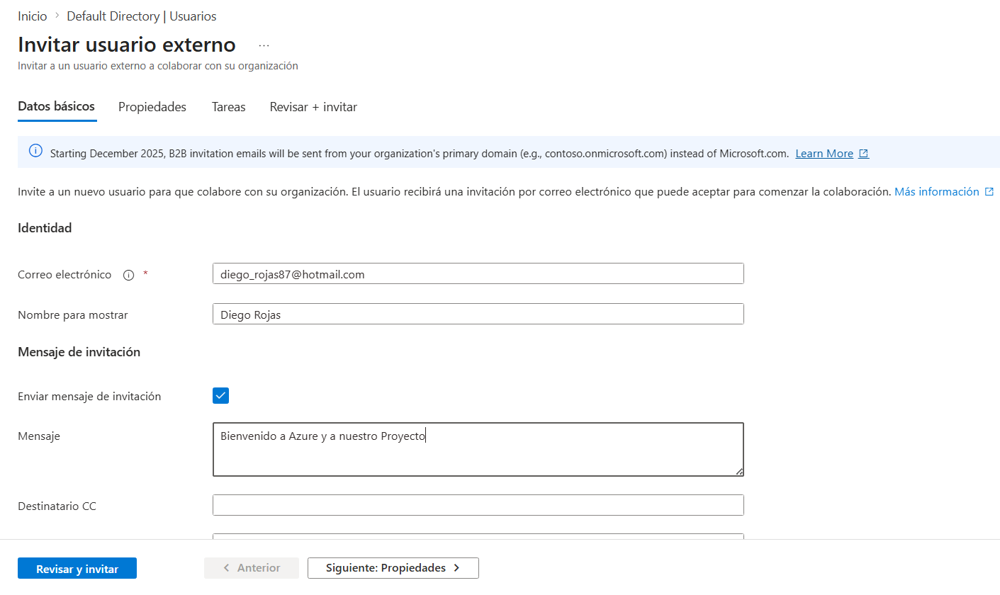

3. Pestaña **Properties**:

   | Campo | Valor |
   |-------|-------|
   | Job title | `IT Lab Administrator` |
   | Department | `IT` |
   | Usage location | **United States** |

   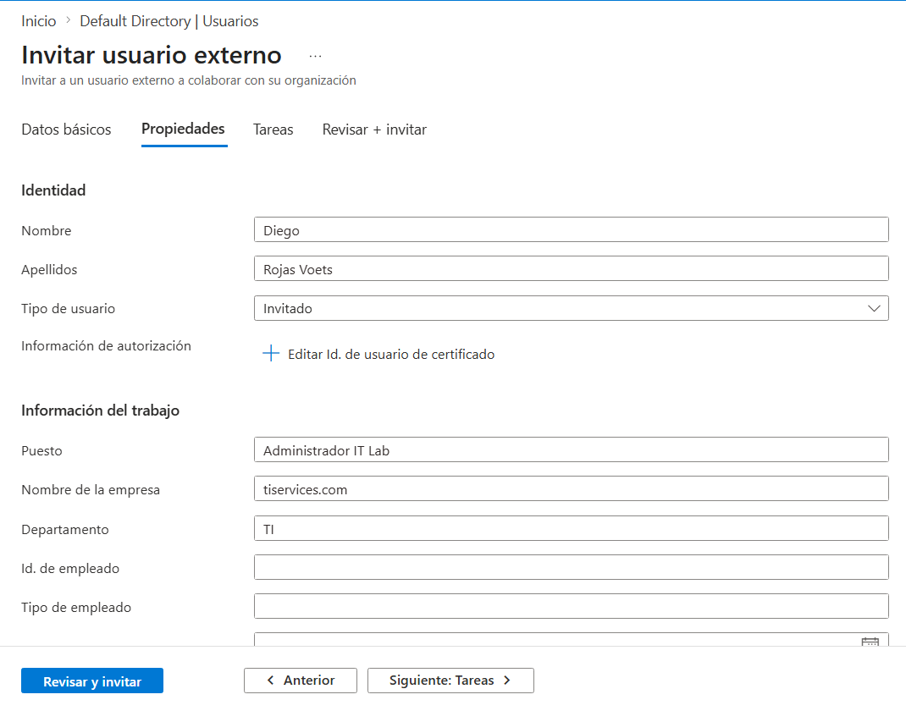

4. **Review + invite** → **Invite**.

   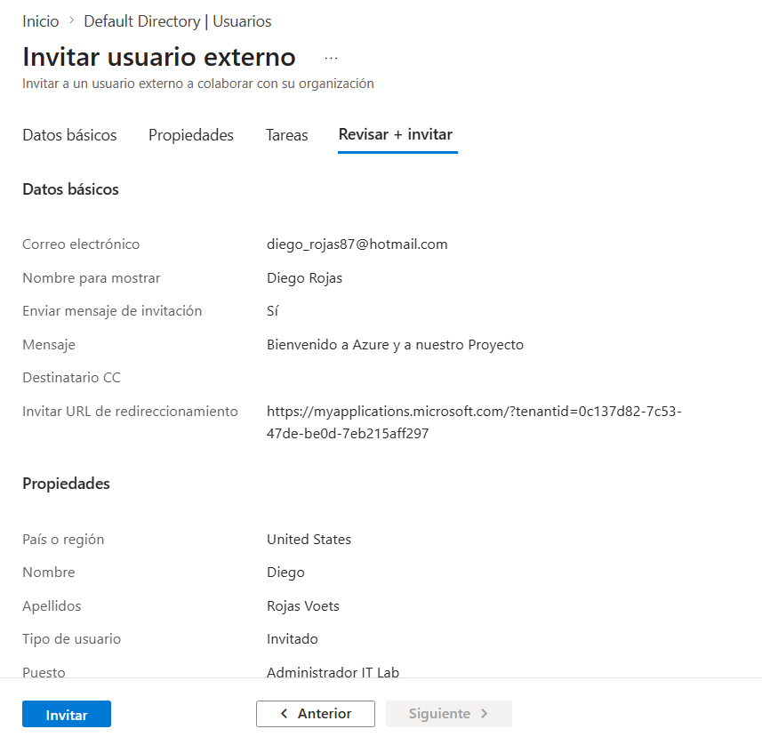

5. Refresca — el guest aparece con sufijo `#EXT#` en su UPN.

   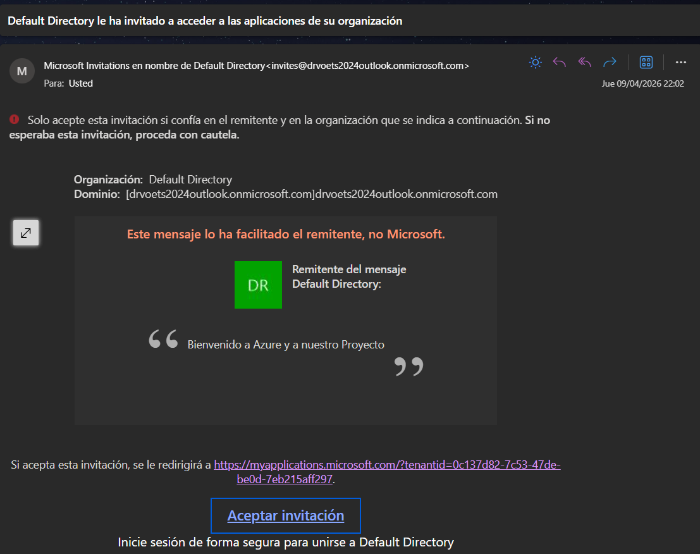

   > El sufijo `#EXT#` es cómo Entra ID transforma el email externo en un UPN interno:
   > `usuario_dominio.com#EXT#@<tu-tenant>.onmicrosoft.com`.
   > Evita colisiones de nombres entre tenants. Detalle frecuente en preguntas de examen B2B.

**Azure CLI**

```bash
az ad invitation create \
  --invited-user-email-address "usuario@externo.com" \
  --invite-redirect-url "https://myapps.microsoft.com" \
  --invited-user-display-name "Usuario Externo" \
  --send-invitation-message true
```

**Resultado esperado:** el guest aparece en la lista con `User type: Guest` y recibes el correo de invitación.

---

## Tarea 2 — Crear grupos y añadir miembros

### 2.1 — Exploración de configuración de grupos

**Portal**

1. Entra ID → **Groups**.

   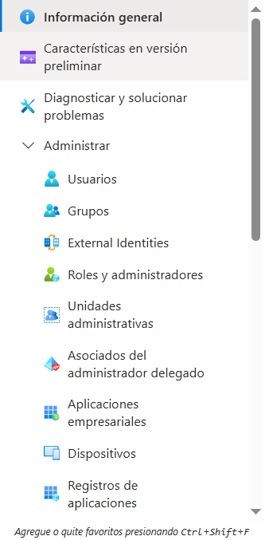

2. Explora el panel izquierdo:
   - **Expiration:** tiempo de vida del grupo en días. Al expirar, el owner debe renovarlo
     o se elimina automáticamente. Útil para grupos temporales de proyecto.
   - **Naming policy:** prefijos/sufijos obligatorios y palabras bloqueadas.
     Importante para gobernanza a escala.

---

### 2.2 — Crear grupo de seguridad con membresía asignada

**Portal**

1. All groups → **+ New group**.

2. Configura:

   | Campo | Valor |
   |-------|-------|
   | Group type | **Security** |
   | Group name | `IT Lab Administrators` |
   | Group description | `Administrators that manage the IT lab` |
   | Membership type | **Assigned** |

   > Si la suscripción incluye Entra ID Premium P1/P2, aparecerán también
   > **Dynamic User** y **Dynamic Device**. Con membresía dinámica podrías
   > definir una regla como `(user.jobTitle -eq "IT Lab Administrator")` y el
   > grupo se actualizaría automáticamente. En este lab usamos Assigned.

3. **No members selected** → busca y añade `az104-user1` y el usuario guest.

   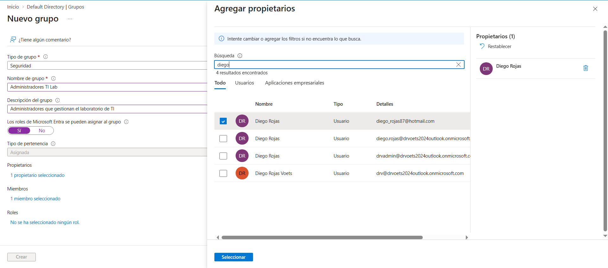

4. **No owners selected** → busca y selecciona tu cuenta → **Select**.

   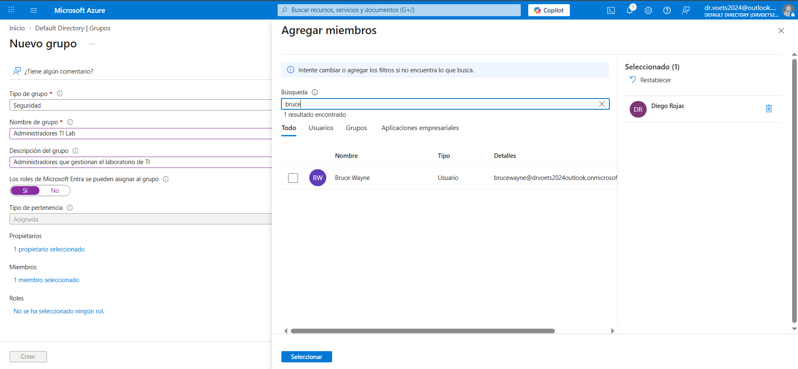

5. **Review + create** → verifica la configuración.

   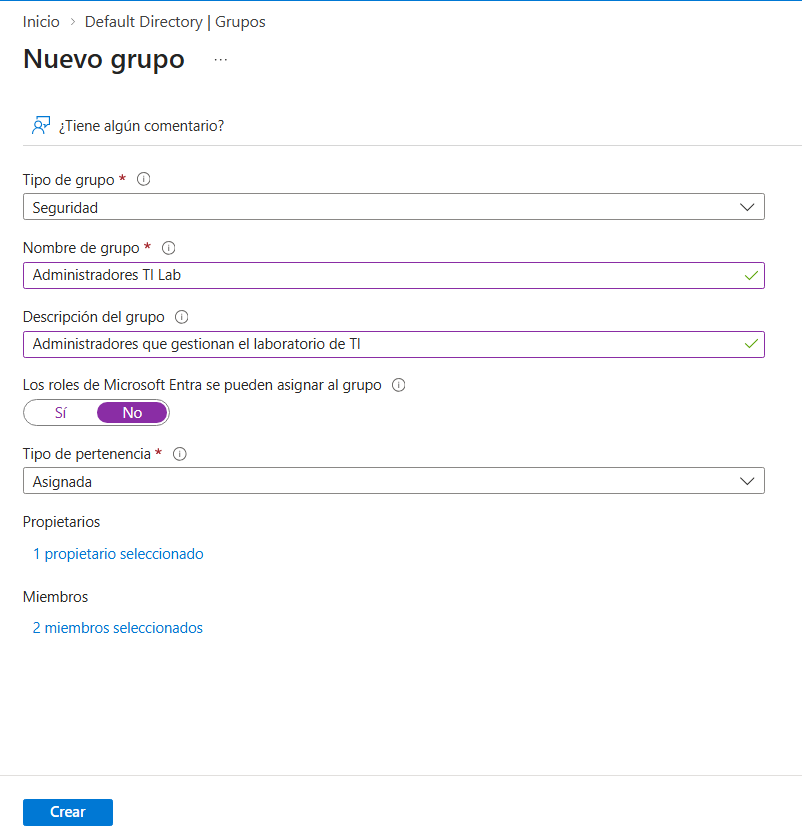

6. **Create**. Refresca y verifica que `IT Lab Administrators` existe.

   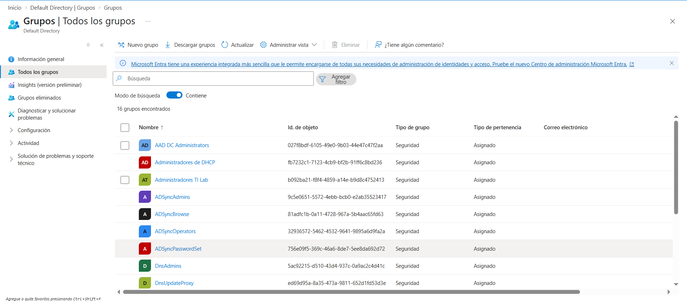

7. Selecciona el grupo → revisa **Members** y **Owners**.

   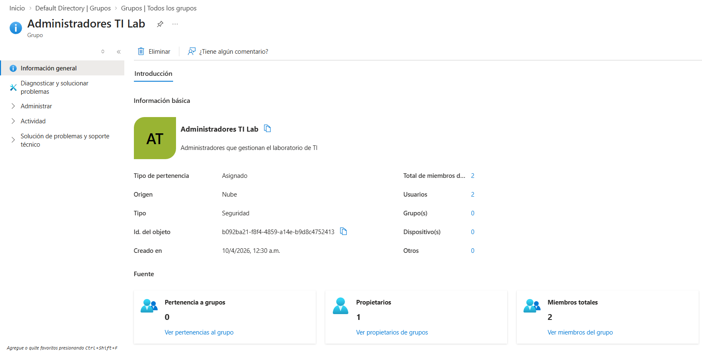

**Azure CLI**

```bash
DOMAIN=$(az ad signed-in-user show --query userPrincipalName -o tsv | cut -d@ -f2)

# Crear el grupo y capturar su ID
GROUP_ID=$(az ad group create \
  --display-name "IT Lab Administrators" \
  --mail-nickname "ITLabAdministrators" \
  --description "Administrators that manage the IT lab" \
  --query id -o tsv)

echo "Grupo creado: ${GROUP_ID}"

# Obtener ID del usuario y añadirlo como miembro
USER_ID=$(az ad user show \
  --id "az104-user1@${DOMAIN}" \
  --query id -o tsv)

az ad group member add \
  --group "${GROUP_ID}" \
  --member-id "${USER_ID}"

# Verificar miembros
az ad group member list \
  --group "${GROUP_ID}" \
  --query "[].{Nombre:displayName, UPN:userPrincipalName}" \
  -o table
```

**Resultado esperado:** grupo `IT Lab Administrators` con 2 miembros y 1 owner.

---

## Errores comunes

### Error 1 — Membresía dinámica no aparece en el dropdown

**Síntoma:** "Membership type" solo muestra "Assigned".

**Causa:** se necesita Entra ID Premium P1 o P2. La suscripción básica no la incluye.

**Solución:** usar Assigned para este lab. Para probar dinámica, activar un trial desde
**Entra ID → Licenses → Try/Buy**.

---

### Error 2 — El correo de invitación B2B no llega

**Síntoma:** se crea el guest pero no llega el correo.

**Causa:** filtro de spam, throttling del tenant emisor, o políticas del tenant destinatario.

**Solución:**
1. Revisa la carpeta de spam.
2. Portal → usuario guest → **Resend invitation**.
3. El usuario puede acceder directamente a [myapps.microsoft.com](https://myapps.microsoft.com).

---

### Error 3 — "Failed to create" al crear un tenant secundario

**Síntoma:** error CAPTCHA o "Too many requests".

**Causa:** Azure aplica throttling en creación de tenants para prevenir abuso.

**Solución:** esperar unos minutos y reintentar. Verificar en **Manage tenants** si el tenant
se creó en background (ocurre con frecuencia).

---

## Limpieza de recursos

### Portal

1. Entra ID → **Groups** → selecciona `IT Lab Administrators` → **Delete**.
2. Entra ID → **Users** → selecciona `az104-user1` → **Delete**.
3. Repite con el usuario guest.
4. Los objetos eliminados permanecen en **Deleted users** 30 días (soft-delete).
   Para borrado definitivo: **Deleted users → seleccionar → Delete permanently**.

### Azure CLI

```bash
DOMAIN=$(az ad signed-in-user show --query userPrincipalName -o tsv | cut -d@ -f2)

USER_ID=$(az ad user show --id "az104-user1@${DOMAIN}" --query id -o tsv)
GROUP_ID=$(az ad group show --group "IT Lab Administrators" --query id -o tsv)

az ad group delete --group "${GROUP_ID}"
az ad user delete --id "${USER_ID}"

echo "Limpieza completada."
```

---

## Costo real documentado

| Concepto | Duración | Costo |
|----------|----------|-------|
| Microsoft Entra ID Free tier | — | $0.00 |
| Entra ID Premium P2 trial (si se activa) | — | $0.00 |
| **Total lab** | | **$0.00** |

**Fecha de ejecución:** [PENDIENTE — añadir cuando se ejecute el lab]
**Captura de billing:** [PENDIENTE — `capturas/billing-lab-01.png`]

> Único lab del AZ-104 con costo efectivamente cero. No se crean recursos de compute,
> storage ni red. Entra ID Free está incluido en cualquier suscripción Azure.

---

## Análisis FinOps rápido

*Análisis completo en: [finops/README.md](../finops/README.md)*

| Concepto | Azure | AWS | GCP | OCI |
|----------|-------|-----|-----|-----|
| IdP cloud nativo | Microsoft Entra ID | IAM Identity Center | Cloud Identity | OCI IAM |
| Usuarios/grupos básicos | Gratis | Gratis | Gratis | Gratis |
| Membresía dinámica | Entra ID P1 (~6 USD/user/mes) | Sin equivalente directo | Google Workspace | IAM Domains |

**¿Cuándo elegir Entra ID?**
Si la organización ya usa Microsoft 365 el tenant existe y los usuarios están sincronizados.
Para entornos híbridos con Active Directory on-premises, Entra Connect sigue siendo
la solución más madura del mercado.

---

## Resumen y siguiente lab

**Conceptos clave:**
- Tenant = instancia aislada de Entra ID. Una organización puede tener múltiples tenants.
- Dos tipos de cuenta: **Member** (interno) y **Guest** B2B (sufijo `#EXT#`).
- Dos tipos de grupo: **Security** (control de acceso a recursos) y **Microsoft 365** (colaboración).
- Membresía **Assigned** (manual) vs **Dynamic** (por atributo — requiere Premium P1/P2).
- `Usage location` es obligatorio para asignar licencias. Campo frecuente en el examen.

**Cómo se usa en labs futuros:**
- `az104-user1` y el grupo `IT Lab Administrators` son los principales de asignación
  en **Lab-02a (RBAC)**: se les asignarán roles de Azure y se verificará el acceso.

**Siguiente lab:**
[Lab 02a — Control de acceso basado en roles (RBAC)](../../Lab-02a-RBAC/lab-base/README.md)

---

> 📸 *Capturas de referencia tomadas de [Slider2019/AZ-104](https://github.com/Slider2019/Lab-01---Gesti-n-de-identidades-de-Microsoft-Entra-ID) bajo licencia MIT.
> Serán reemplazadas por capturas propias al ejecutar el lab en Azure.*

---

*Lab documentado por [RoadmapMultiCloud-ES](../../../../../README.md) · Licencia [CC BY-NC-SA 4.0](../../../../../LICENSE)*
