# ARM Templates y Bicep — Lab 03

> Fase: F2 | Cert: AZ-104 | Lab: 03 | Tipo: base

---
**Fase:** F2 — Administración
**Certificación:** AZ-104
**Lab número:** 03
**Tipo:** base
**Última actualización:** 2026-05
**Costo real documentado:** ~$0.01 USD (5 discos HDD S4 32GiB ~1h)
**Región usada:** East US
**Duración estimada:** 45 minutos

---

## 📋 Índice

- [Objetivos](#objetivos)
- [Prerequisitos](#prerequisitos)
- [Servicios utilizados](#servicios-utilizados)
- [Arquitectura del lab](#arquitectura-del-lab)
- [Tarea 1 — Crear un disco administrado y exportar plantilla ARM](#tarea-1)
- [Tarea 2 — Editar y redesplegar la plantilla ARM](#tarea-2)
- [Tarea 3 — Desplegar con PowerShell desde Cloud Shell](#tarea-3)
- [Tarea 4 — Desplegar con CLI desde Cloud Shell](#tarea-4)
- [Tarea 5 — Desplegar con Bicep](#tarea-5)
- [Errores comunes](#errores-comunes)
- [Limpieza de recursos](#limpieza-de-recursos)
- [Costo real](#costo-real-documentado)
- [Análisis FinOps rápido](#análisis-finops-rápido)
- [Resumen y siguiente lab](#resumen-y-siguiente-lab)

---

## 🎯 Objetivos

Al completar este lab serás capaz de:

- [ ] Exportar una plantilla ARM desde un recurso existente en el portal
- [ ] Editar y reutilizar una plantilla ARM para redesplegar recursos con configuración diferente
- [ ] Desplegar recursos usando Azure PowerShell desde Cloud Shell
- [ ] Desplegar recursos usando Azure CLI desde Cloud Shell
- [ ] Desplegar recursos usando Bicep como alternativa moderna a ARM

**Habilidades del examen que cubre este lab:**
> **Deploy and manage Azure compute resources (20–25%)**
> — Deploy resources by using Azure Resource Manager templates
> — Manage Azure Resource Manager templates
> — Deploy resources to Azure by using Bicep

---

## ✅ Prerequisitos

**Labs anteriores requeridos:**
- [ ] Lab 02a — RBAC *(el Resource Group `az104-rg3` se crea en este lab)*

**Acceso necesario:**
- Suscripción Azure activa con rol **Contributor** o superior
- Azure CLI instalada y con sesión activa (`az login`)
- Azure PowerShell instalado (`Az` module) o acceso a Cloud Shell

**Conocimientos previos:**
- Diferencia entre infraestructura imperativa (scripts) y declarativa (IaC)
- Concepto de idempotencia en despliegues: ejecutar la misma plantilla dos veces produce el mismo resultado
- Estructura básica de JSON

---

## 🛠️ Servicios utilizados

| Servicio | Propósito en este lab | Costo aprox. |
|----------|----------------------|--------------|
| Azure Managed Disks (HDD S4 32GiB) | Recurso de práctica para IaC | ~$0.002/hora |
| Azure Cloud Shell | Entorno de ejecución de scripts | $0.00 |
| Azure Storage (Cloud Shell) | Almacenamiento de archivos del shell | ~$0.002/hora |

---

## 🏗️ Arquitectura del lab

```
Resource Group: az104-rg3
│
├── az104-disk1   ← Tarea 1: creado desde portal, plantilla exportada
├── az104-disk2   ← Tarea 2: redespliegue editando la plantilla ARM
├── az104-disk3   ← Tarea 3: desplegado con PowerShell desde Cloud Shell
├── az104-disk4   ← Tarea 4: desplegado con CLI desde Cloud Shell
└── az104-disk5   ← Tarea 5: desplegado con Bicep (StandardSSD_LRS)
```

**Lo que construimos en este lab:**
Cinco discos administrados, cada uno desplegado con un método diferente: portal, ARM editado, PowerShell, CLI y Bicep. El objetivo no es la infraestructura final sino dominar los cuatro caminos de despliegue IaC en Azure.

**Cómo conecta con labs anteriores:**
> Usa el Resource Group `az104-rg3` creado en este lab. No depende de recursos de labs anteriores.

---

## Tarea 1 — Crear un disco administrado y exportar plantilla ARM

**Objetivo de la tarea:** Crear un disco administrado desde el portal y exportar su plantilla ARM. La exportación permite capturar la configuración exacta de un recurso como código reutilizable.

### Método A — Portal web

1. Navega al portal → busca **Discos** → **+ Crear**

   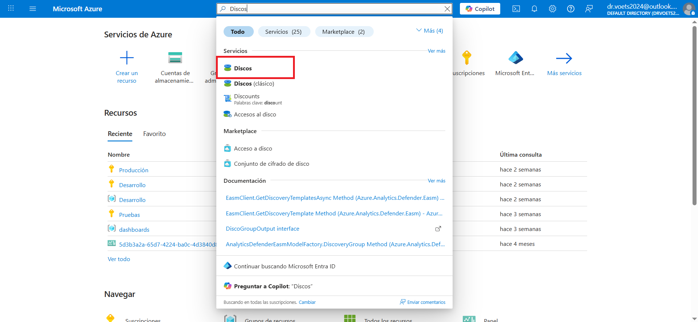

2. Selecciona **Crear** en la página de Discos

   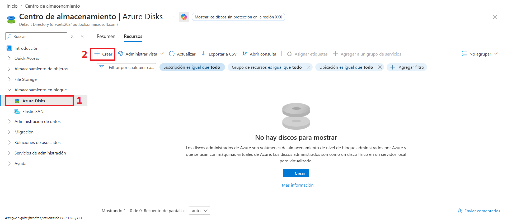

3. Configura el disco:
   - **Resource Group:** `az104-rg3` (crear nuevo si no existe)
   - **Disk name:** `az104-disk1`
   - **Region:** `East US`
   - **Availability zone:** No infrastructure redundancy required
   - **Source type:** None
   - **Performance:** Standard HDD → **Change size** → 32 GiB (S4)

   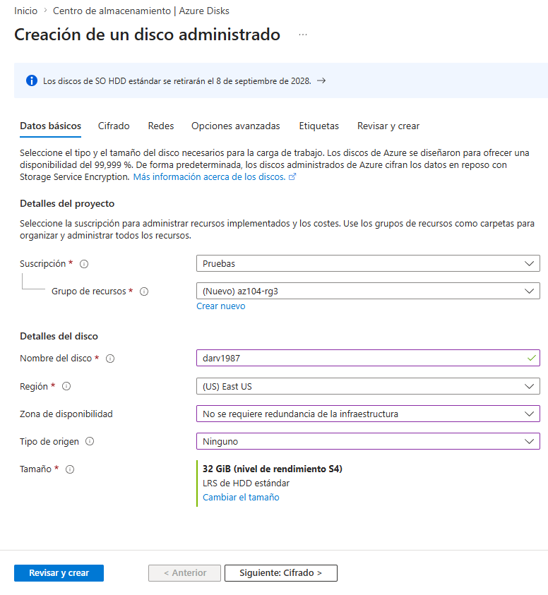

4. Selecciona **Revisar y crear** → **Crear** → cuando termine, **Ir al recurso**

   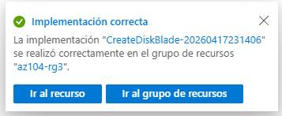

5. En el panel **Automatización** → **Exportar plantilla**

   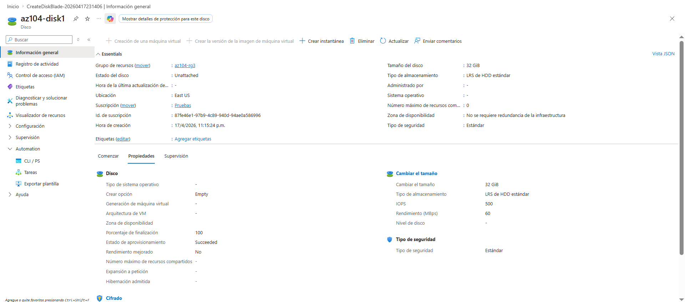

6. Haz clic en **Descargar** — guarda `template.json` y `parameters.json` en tu equipo

   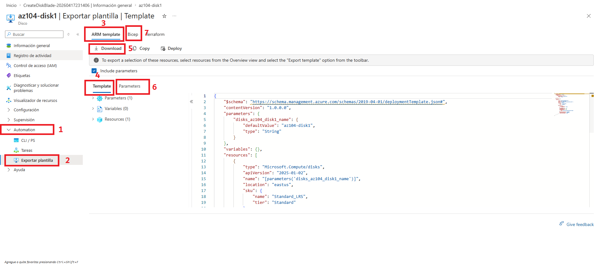

### Método B — CLI

```powershell
# Crear resource group
az group create --name "az104-rg3" --location "eastus"

# Crear disco HDD S4 32GiB
az disk create `
  --name "az104-disk1" `
  --resource-group "az104-rg3" `
  --location "eastus" `
  --sku "Standard_LRS" `
  --size-gb 32

# Exportar la plantilla ARM del recurso
az group export --name "az104-rg3" --output json > template.json
```

**Resultado esperado:**
> El disco `az104-disk1` aparece en el Resource Group con SKU Standard HDD 32GiB. Tienes dos archivos JSON (`template.json` y `parameters.json`) descargados localmente.

---

## Tarea 2 — Editar y redesplegar la plantilla ARM

**Objetivo de la tarea:** Modificar la plantilla descargada para crear un segundo disco con nombre diferente, sin usar el portal. Esto demuestra el patrón IaC fundamental: definir infraestructura como código y reutilizarla.

### Método A — Portal web

1. Portal → busca **Implementar una plantilla personalizada** → **Cree su propia plantilla en el editor**

   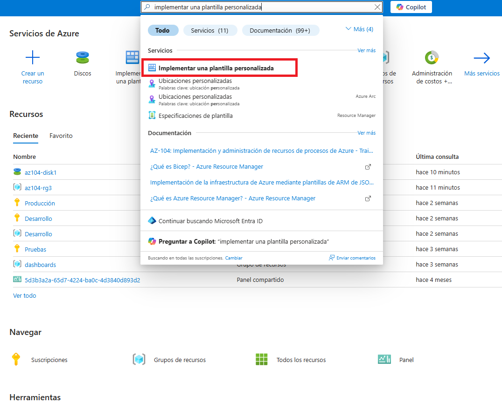

2. Observa las plantillas comunes disponibles

   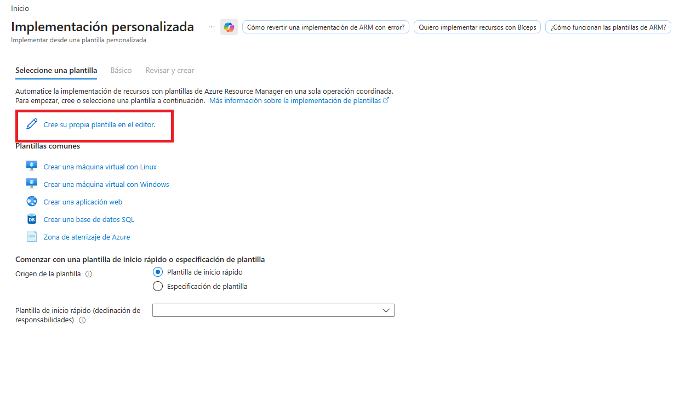

3. **Cargar archivo** → selecciona `template.json`

   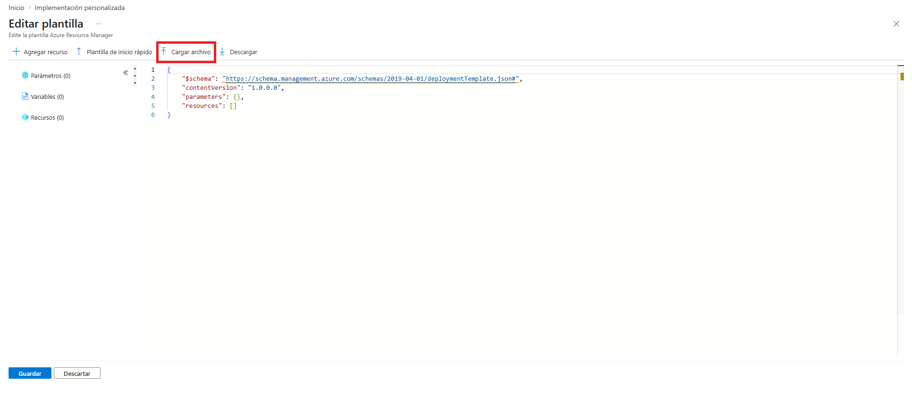

4. Edita el JSON — cambia `disks_az104_disk1_name` → `disk_name` y `az104-disk1` → `az104-disk2`

   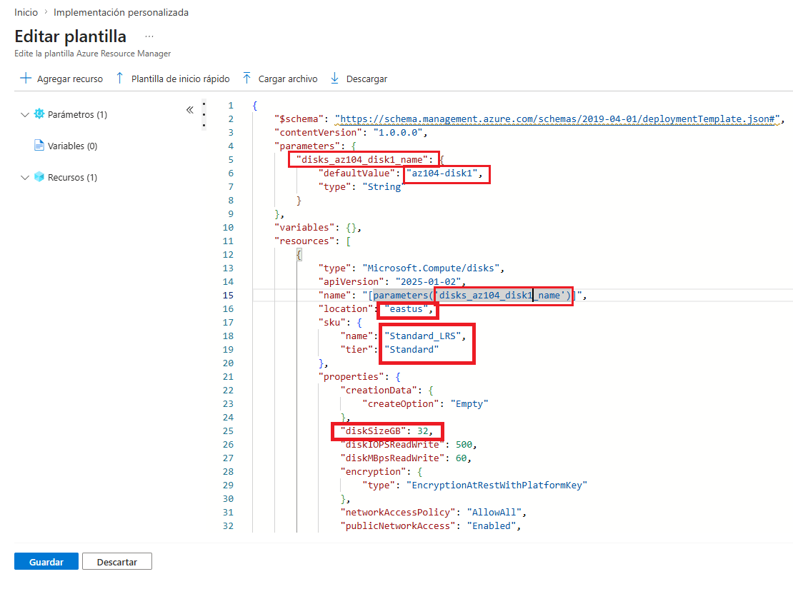

5. **Guardar** → **Editar parámetros** → **Cargar archivo** → `parameters.json`

   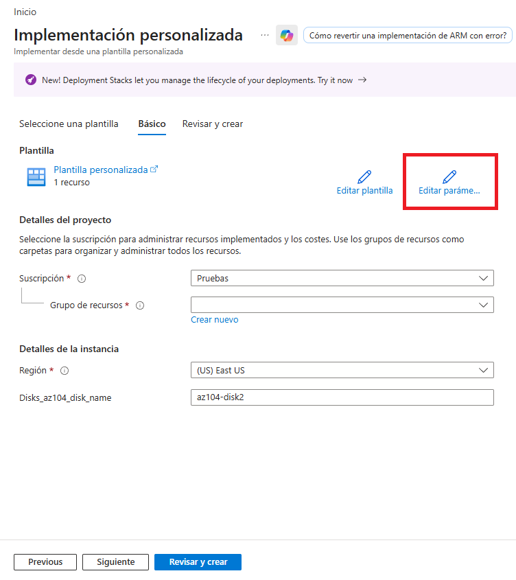

6. Cambia `disks_az104_disk1_name` → `disk_name` en el JSON de parámetros

   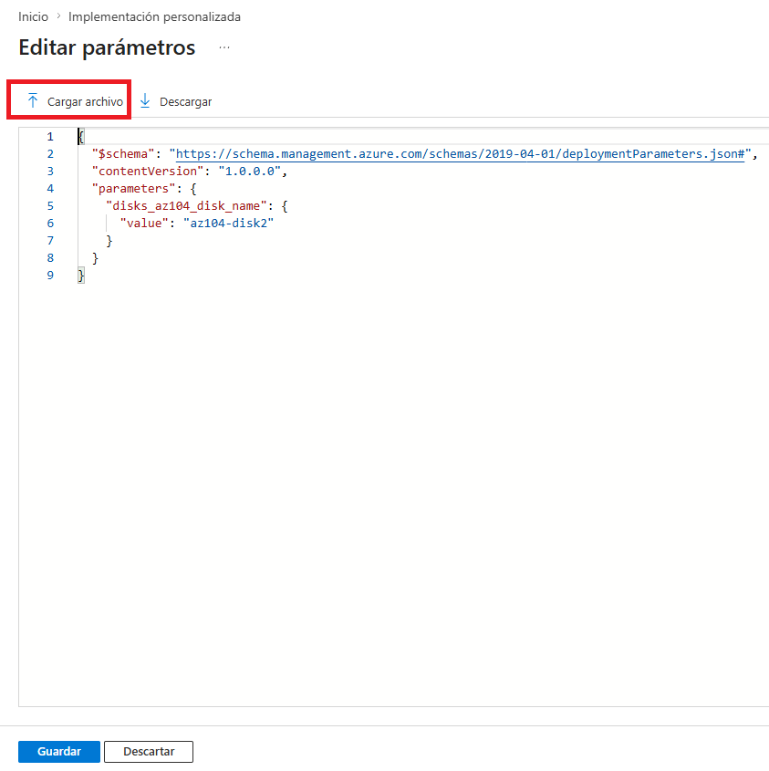

7. Configura el despliegue:
   - **Resource group:** `az104-rg3`
   - **Disk_name:** `az104-disk2`

   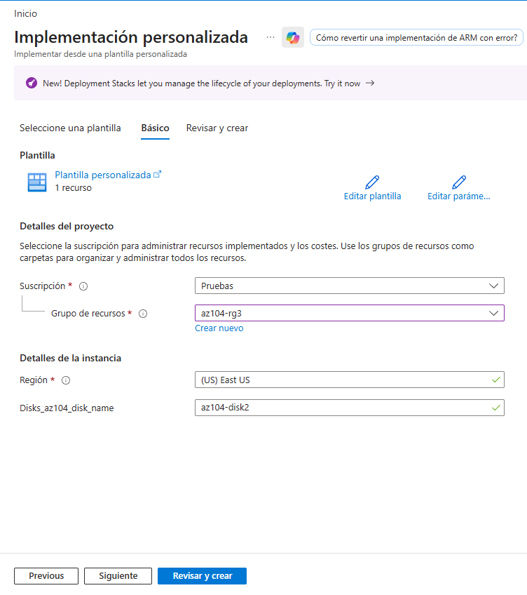

8. **Revisar y crear** → **Crear** → verifica que `az104-disk2` existe

   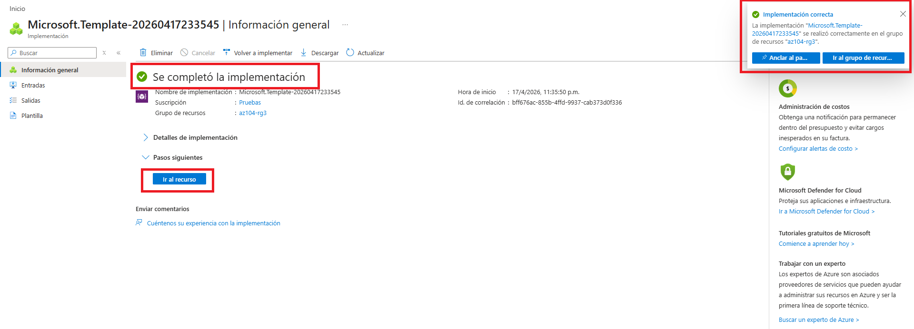

9. En el RG debes ver ya dos discos

   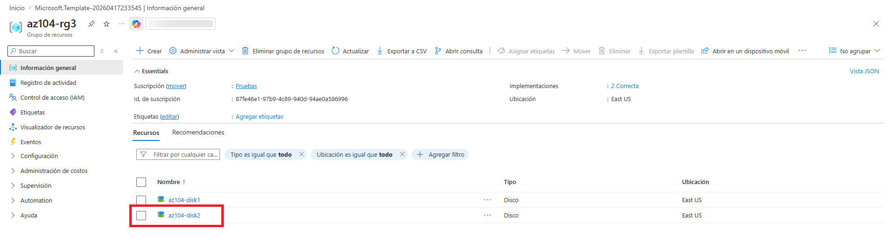

### Método B — CLI

```powershell
# Editar template.json localmente:
# Cambiar "disks_az104_disk1_name" por "disk_name" (2 ocurrencias)
# Cambiar "az104-disk1" por "az104-disk2" (1 ocurrencia)

# Redesplegar
az deployment group create `
  --resource-group "az104-rg3" `
  --template-file "template.json" `
  --parameters "parameters.json" disk_name="az104-disk2"
```

**Resultado esperado:**
> El disco `az104-disk2` aparece en `az104-rg3`. En **Ajustes → Implementaciones** del RG puedes ver el historial de los dos despliegues.

---

## Tarea 3 — Desplegar con PowerShell desde Cloud Shell

**Objetivo de la tarea:** Usar Azure PowerShell en Cloud Shell para desplegar un tercer disco editando la plantilla directamente en el shell. Cloud Shell es el entorno interactivo de Azure accesible desde el browser.

### Método A — Cloud Shell

1. Abre Cloud Shell (icono `>_` arriba a la derecha) → selecciona **PowerShell**

   

2. Si es la primera vez, configura almacenamiento. Luego: **Configuración** → **Ir a la versión clásica**

   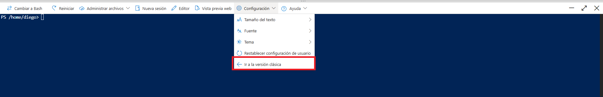

3. **Cargar/Descargar archivos** → **Subir** → sube `template.json` y `parameters.json`

   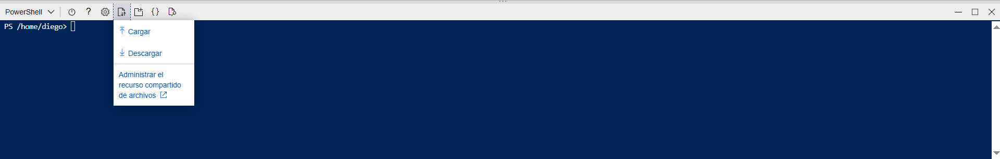

4. **Editor** (`{}`) → navega a `template.json`

   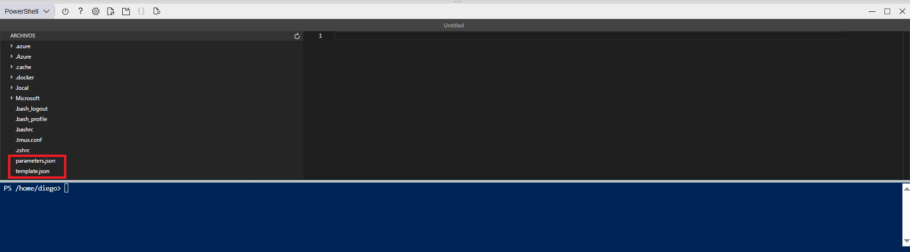

5. Cambia el nombre del disco a `az104-disk3` → **Ctrl+S** para guardar → **Ctrl+Q** para cerrar

   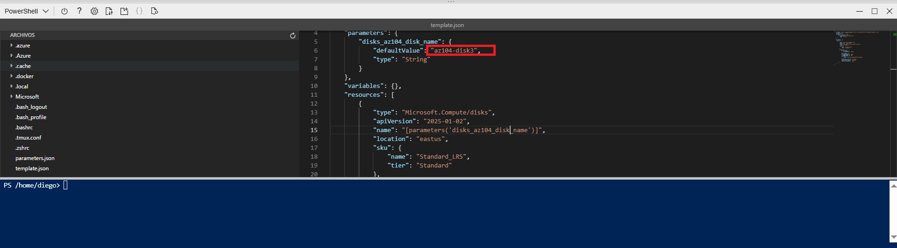

   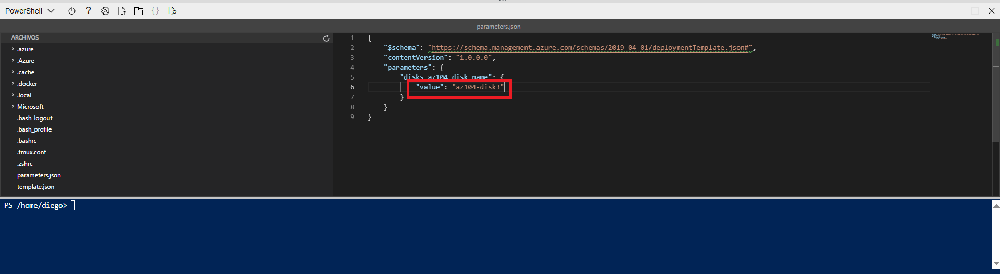

6. Despliega con PowerShell:

```powershell
New-AzResourceGroupDeployment `
  -ResourceGroupName "az104-rg3" `
  -TemplateFile "template.json" `
  -TemplateParameterFile "parameters.json"
```

7. Verifica que el `ProvisioningState` sea **Succeeded**

   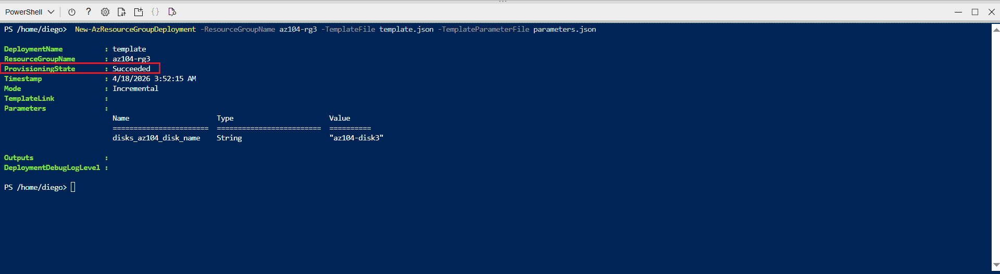

8. Lista los discos del RG:

```powershell
Get-AzDisk | ft Name, ResourceGroupName, Location, DiskSizeGb, ProvisioningState
```

   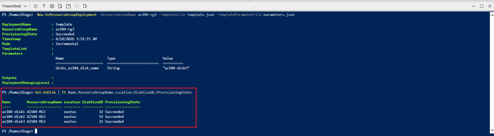

**Resultado esperado:**
> El disco `az104-disk3` aparece en la lista con ProvisioningState `Succeeded`. En el RG tienes ya tres discos.

---

## Tarea 4 — Desplegar con CLI desde Cloud Shell

**Objetivo de la tarea:** Cambiar a Bash en Cloud Shell y desplegar un cuarto disco usando Azure CLI. Permite comparar el flujo PowerShell vs CLI en el mismo entorno.

### Método A — Cloud Shell (Bash)

1. En Cloud Shell, cambia a **Bash**

   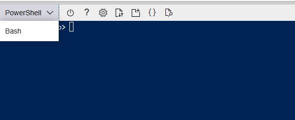

   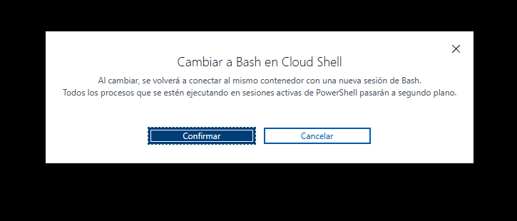

2. Verifica que los archivos están disponibles:

```bash
ls
```

   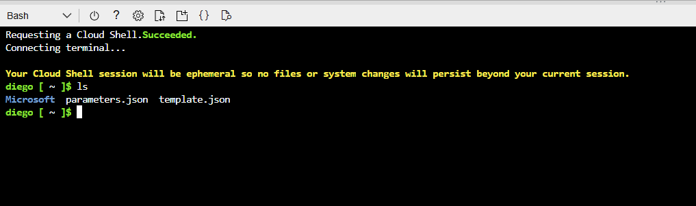

3. Edita `template.json` → cambia el disco a `az104-disk4` → **Ctrl+S** → **Ctrl+Q**

   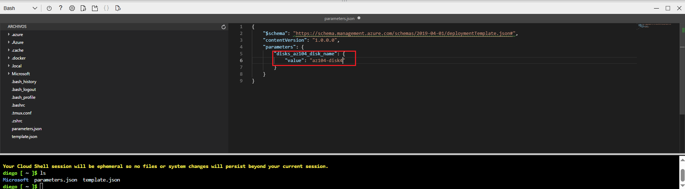

4. Despliega con CLI:

```bash
az deployment group create \
  --resource-group "az104-rg3" \
  --template-file "template.json" \
  --parameters "parameters.json"
```

   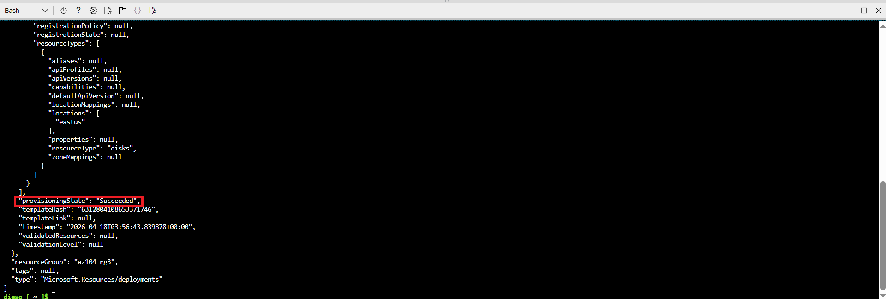

5. Lista los discos:

```bash
az disk list --resource-group "az104-rg3" --output table
```

   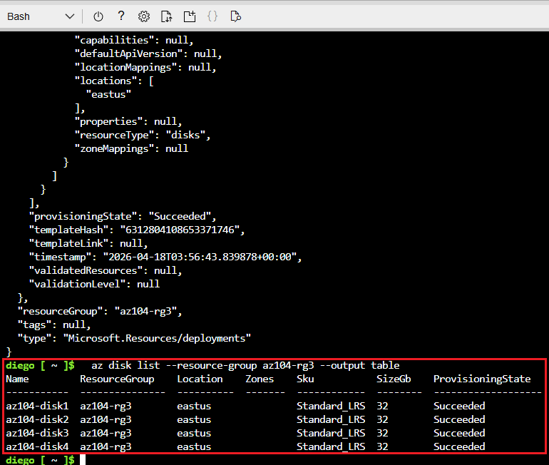

**Resultado esperado:**
> El disco `az104-disk4` aparece en la lista. Tienes cuatro discos en el RG desplegados con cuatro métodos distintos.

---

## Tarea 5 — Desplegar con Bicep

**Objetivo de la tarea:** Usar Bicep como alternativa moderna y más legible a las plantillas ARM JSON. Bicep compila a ARM en el backend pero con sintaxis mucho más concisa.

### Método A — Cloud Shell (Bash)

1. Descarga el archivo Bicep del lab oficial o usa el del repositorio

   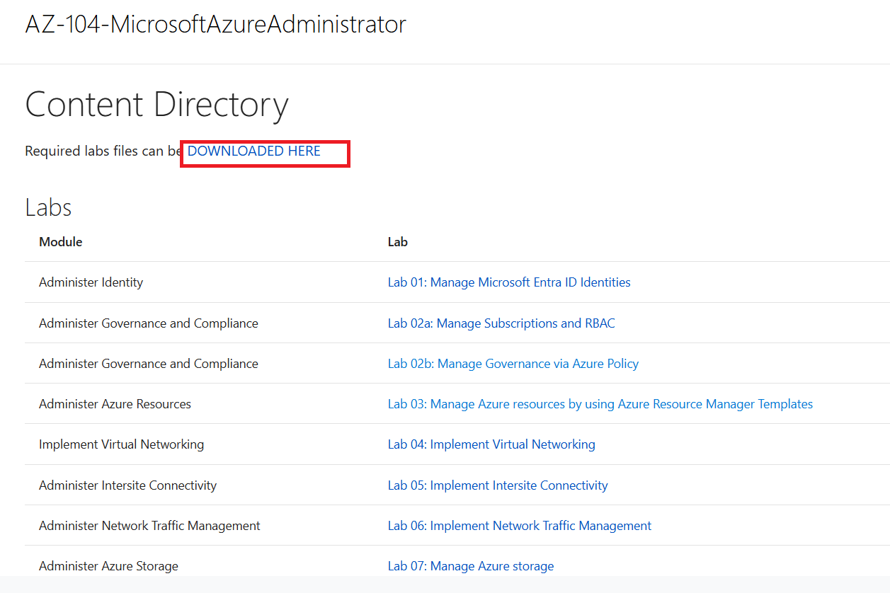

2. Sube el archivo `azuredeploydisk.bicep` a Cloud Shell

   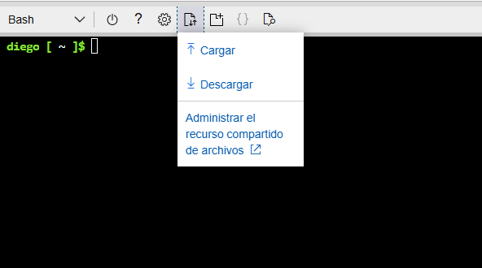

3. Edita el archivo — cambia:
   - `managedDiskName` → `az104-disk5`
   - `diskSizeinGiB` → `32`
   - `sku name` → `StandardSSD_LRS`

   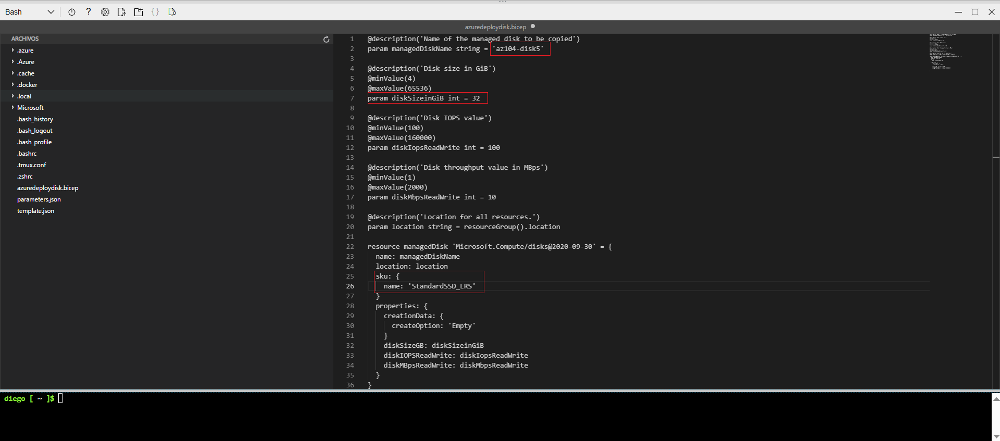

4. Despliega:

```bash
az deployment group create \
  --resource-group "az104-rg3" \
  --template-file "azuredeploydisk.bicep"
```

   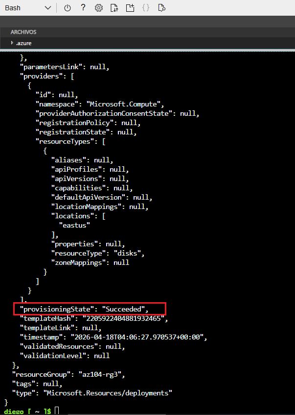

5. Verifica los 5 discos:

```bash
az disk list --resource-group "az104-rg3" --output table
```

   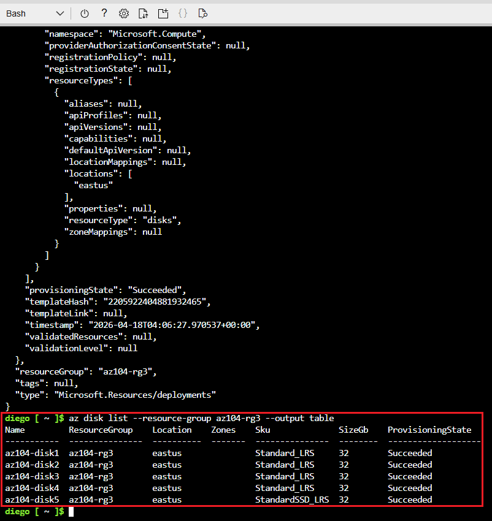

### Método C — IaC (Bicep completo)

```bicep
// azuredeploydisk.bicep
param location string = 'eastus'

var managedDiskName = 'az104-disk5'
var diskSizeinGiB = 32

resource disk 'Microsoft.Compute/disks@2023-10-02' = {
  name: managedDiskName
  location: location
  sku: {
    name: 'StandardSSD_LRS'
  }
  properties: {
    creationData: {
      createOption: 'Empty'
    }
    diskSizeGB: diskSizeinGiB
  }
}
```

**Resultado esperado:**
> El disco `az104-disk5` con SKU StandardSSD_LRS aparece en el RG. El resultado final muestra cinco discos, cada uno desplegado con un método distinto.

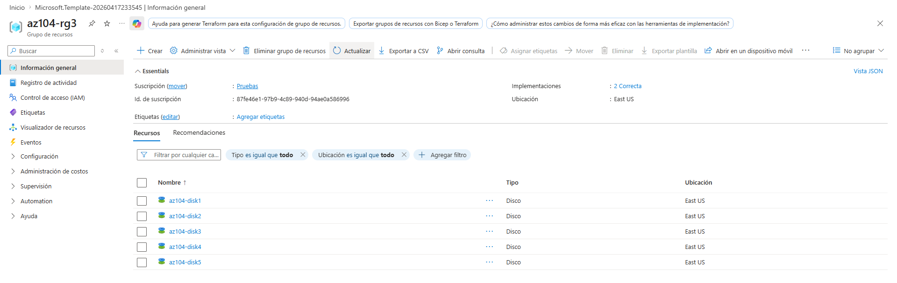

---

## ⚠️ Errores comunes

### Error 1 — El tamaño de VM/disco no está disponible en la región

**Síntoma:**
```
The requested VM size is not available in the current region
```

**Causa:** La región seleccionada no tiene capacidad para el SKU solicitado.

**Solución:**
```powershell
# Listar tamaños de disco disponibles en una región
az disk list-skus --location "eastus" --output table
# Cambiar la región en el template o usar un SKU alternativo
```

---

### Error 2 — `InvalidTemplateDeployment` al redesplegar

**Síntoma:**
```
The template deployment failed because of policy violation
```

**Causa:** Si tienes políticas de Azure Policy activas del Lab-02b (ubicaciones permitidas), el despliegue falla si la región del disco no está en la lista.

**Solución:** Verifica que estás desplegando en `eastus` o la región permitida por tu Policy, o elimina temporalmente la Policy del Lab-02b.

---

### Error 3 — `BlobAccessTierNotSupported` al subir archivos a Cloud Shell

**Síntoma:** Los archivos no se suben en la versión moderna de Cloud Shell.

**Causa:** La versión moderna de Cloud Shell cambió el flujo de carga de archivos.

**Solución:** Usa **Configuración → Ir a la versión clásica** antes de subir archivos.

---

## 🧹 Limpieza de recursos

> ⚠️ Los 5 discos acumulan costo mínimo pero elimínalos al terminar.

### Método A — Portal

Navega al Resource Group `az104-rg3` → **Eliminar grupo de recursos** → confirma

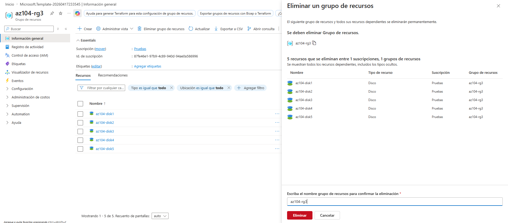

### Método B — CLI

```powershell
az group delete --name "az104-rg3" --yes --no-wait
```

### Método C — PowerShell

```powershell
Remove-AzResourceGroup -Name "az104-rg3" -Force -AsJob
```

---

## 💰 Costo real documentado

| Concepto | Duración | Costo |
|----------|----------|-------|
| 5× Disco HDD S4 32GiB | ~1 hora | ~$0.011 USD |
| Cloud Shell Storage | ~1 hora | ~$0.001 USD |
| **Total lab** | | **~$0.01 USD** |

**Fecha de ejecución:** [VERIFICAR COSTO — completar al ejecutar]
**Región:** East US
**Notas de costo:** El costo es mínimo si se eliminan los recursos al terminar. El HDD S4 cuesta $1.54/mes = $0.002/hora.

---

## 📊 Análisis FinOps rápido

| Concepto | Azure | AWS | GCP | OCI |
|----------|-------|-----|-----|-----|
| IaC nativa | ARM / Bicep | CloudFormation | Deployment Manager | Resource Manager |
| IaC multi-cloud | Terraform | Terraform | Terraform | Terraform |
| Almacenamiento en bloque | Managed Disks | EBS | Persistent Disk | Block Volume |
| Costo disco 32GiB HDD/mes | ~$1.54 | ~$1.60 | ~$1.28 | ~$1.20 |

**¿Cuándo usar Bicep vs ARM vs Terraform?**
> Bicep es la opción recomendada para proyectos Azure-only: más legible que ARM JSON y con soporte completo de tipos. Terraform es preferible en entornos multi-cloud o cuando el equipo ya lo usa. ARM JSON queda para compatibilidad con herramientas que no soportan Bicep aún.

---

## 📝 Resumen y siguiente lab

**Lo que aprendiste en este lab:**
- Exportar una plantilla ARM desde un recurso existente es la forma más rápida de arrancar con IaC en Azure
- La misma infraestructura puede desplegarse con cuatro métodos distintos — el resultado es idéntico
- Bicep reduce significativamente el código respecto a ARM JSON sin perder funcionalidad
- Cloud Shell elimina la necesidad de instalar herramientas localmente para despliegues ocasionales

**Cómo se usa en labs futuros:**
> El patrón de despliegue con plantillas ARM se usa en **Lab-06 Traffic Manager** y **Lab-10 Backup**, donde la infraestructura base se provisiona automáticamente con templates antes de configurar los servicios.

**Siguiente lab recomendado:**
👉 [Lab 04 — Virtual Networking](../../Lab-04-VNets/lab-base/README.md)

---

*Lab documentado por el proyecto [RoadmapMultiCloud-ES](../../../../../../README.md)*
*Licencia: [CC BY-NC-SA 4.0](../../../../../../LICENSE)*
