# Azure Container Instances — Lab 09b

> Fase: F2 | Cert: AZ-104 | Lab: 09b | Tipo: base

---
**Fase:** F2 — Administración
**Certificación:** AZ-104
**Lab número:** 09b
**Tipo:** base
**Última actualización:** 2026-05
**Costo real documentado:** ~$0.014 USD (1 vCPU + 1.5GB RAM × 15 min)
**Región usada:** East US
**Duración estimada:** 20 minutos

---

## 📋 Índice

- [Objetivos](#objetivos)
- [Prerequisitos](#prerequisitos)
- [Servicios utilizados](#servicios-utilizados)
- [Arquitectura del lab](#arquitectura-del-lab)
- [Tarea 1 — Desplegar contenedor con imagen Docker](#tarea-1)
- [Tarea 2 — Verificar el despliegue](#tarea-2)
- [Errores comunes](#errores-comunes)
- [Limpieza de recursos](#limpieza-de-recursos)
- [Costo real](#costo-real-documentado)
- [Análisis FinOps rápido](#análisis-finops-rápido)
- [Resumen y siguiente lab](#resumen-y-siguiente-lab)

---

## 🎯 Objetivos

Al completar este lab serás capaz de:

- [ ] Desplegar un contenedor Docker en Azure sin gestionar infraestructura
- [ ] Configurar DNS público para acceso al contenedor
- [ ] Verificar el estado del contenedor y revisar logs de ejecución

**Habilidades del examen que cubre este lab:**
> **Deploy and manage Azure compute resources (20–25%)**
> — Configure Azure Container Instances

---

## ✅ Prerequisitos

**Acceso necesario:**
- Suscripción Azure activa con rol **Contributor**

**Conocimientos previos:**
- Concepto de contenedor Docker: imagen = plantilla, contenedor = instancia en ejecución
- ACI vs App Service: ACI es para contenedores efímeros o sin estado; App Service tiene más gestión del ciclo de vida

---

## 🛠️ Servicios utilizados

| Servicio | Propósito en este lab | Costo aprox. |
|----------|----------------------|--------------|
| Azure Container Instances | Ejecutar imagen Docker sin VM | $0.0486/vCPU/hora |
| DNS Label público | Nombre DNS para acceder al contenedor | $0.00 |

---

## 🏗️ Arquitectura del lab

```
Internet
    │
    ▼
ACI: az104-c1
├── Image: mcr.microsoft.com/azuredocs/aci-helloworld:latest
├── OS: Linux
├── CPU: 1 vCPU | RAM: 1.5 GB
├── Port: 80 (HTTP)
└── DNS: <dns-label>.eastus.azurecontainer.io
```

**Lo que construimos en este lab:**
Un contenedor accesible públicamente via DNS que ejecuta una aplicación web de bienvenida. Demuestra el valor de ACI: de cero a aplicación en producción en menos de 3 minutos, sin gestionar VMs ni clusters.

---

## Tarea 1 — Desplegar contenedor con imagen Docker

**Objetivo de la tarea:** Crear una instancia de contenedor Azure directamente desde una imagen pública de Docker Hub / Microsoft Container Registry. ACI provisiona el cómputo, red y almacenamiento automáticamente.

### Método A — Portal web

1. Portal → **Container Instances** → **+ Create**

   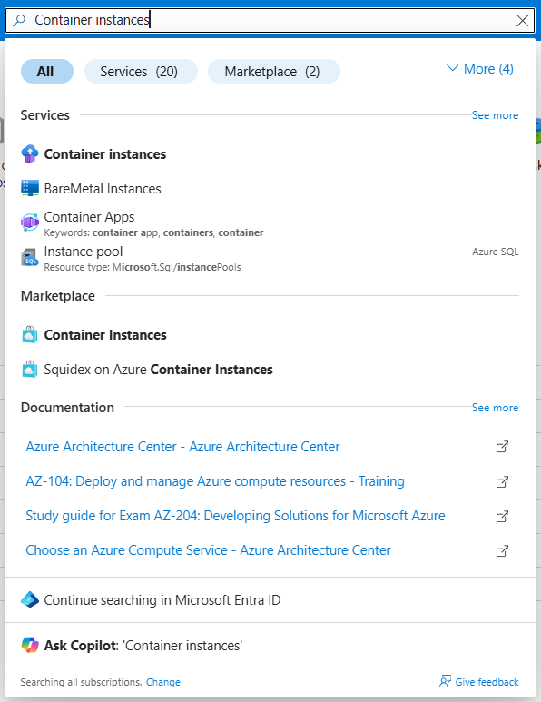
   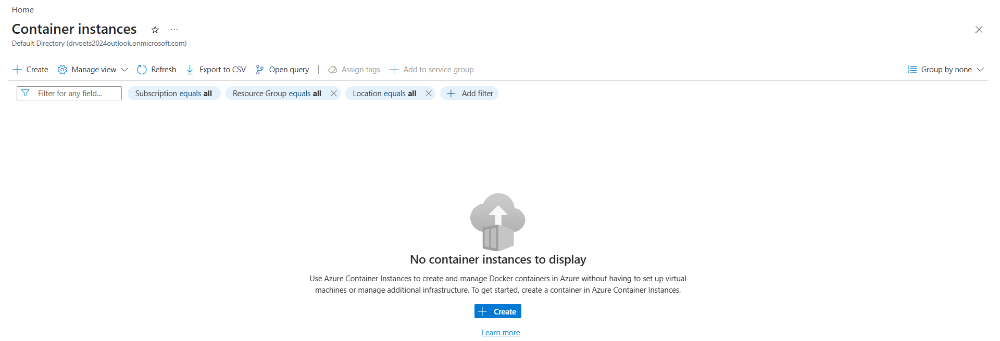

2. Configura **Basics**:
   - **RG:** `az104-rg9` | **Container name:** `az104-c1`
   - **Region:** East US | **Image source:** Quickstart images
   - **Image:** `mcr.microsoft.com/azuredocs/aci-helloworld:latest` (Linux)

   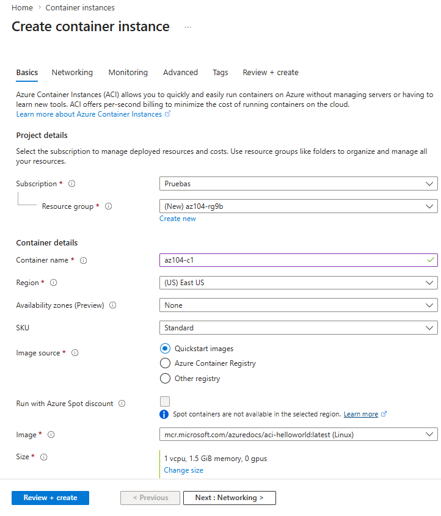

3. Pestaña **Networking**:
   - **DNS name label:** introduce un nombre único (será `<nombre>.eastus.azurecontainer.io`)

   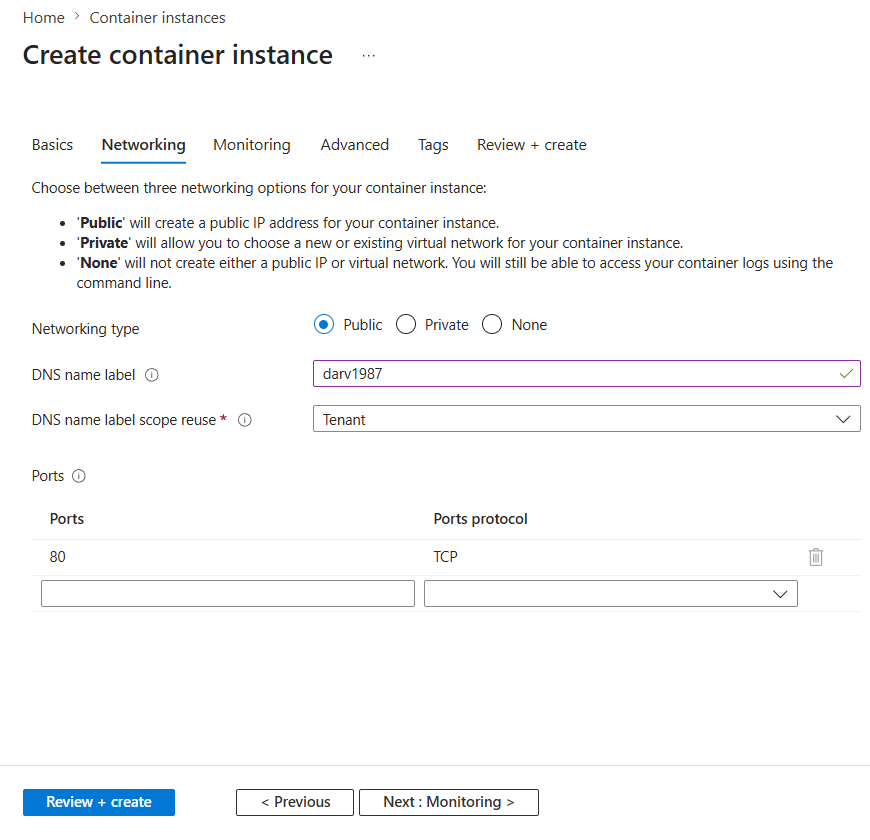

4. Pestaña **Monitoring** → desactiva **Enable container instance logs**

   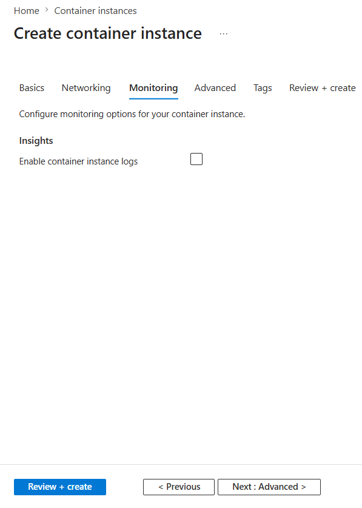

5. Pestaña **Advanced** → sin cambios

   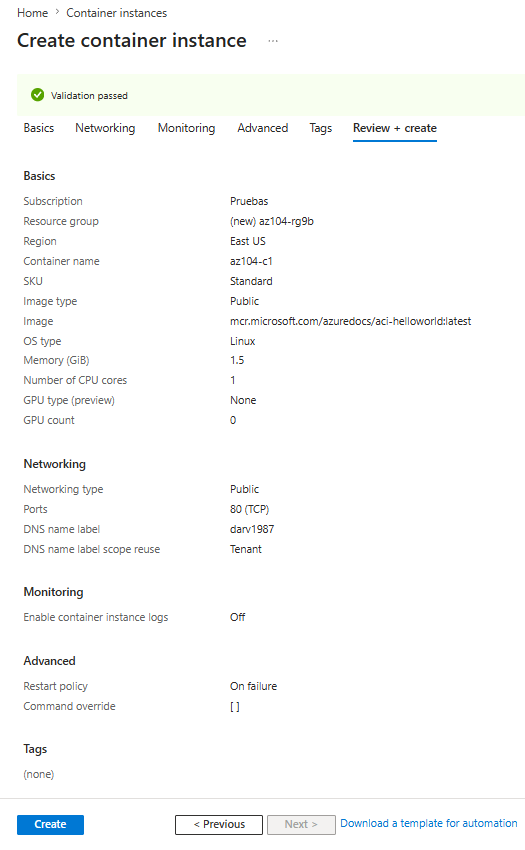

6. **Review + Create** → **Create** → espera 2-3 minutos

### Método B — CLI

```powershell
az group create --name "az104-rg9" --location "eastus"

$dnsLabel = "az104-aci-$(Get-Random -Maximum 9999)"
az container create `
  --name "az104-c1" `
  --resource-group "az104-rg9" `
  --image "mcr.microsoft.com/azuredocs/aci-helloworld:latest" `
  --cpu 1 `
  --memory 1.5 `
  --ports 80 `
  --dns-name-label $dnsLabel `
  --location "eastus"

Write-Host "URL: http://$dnsLabel.eastus.azurecontainer.io"
```

**Resultado esperado:**
> Contenedor `az104-c1` en estado **Running** con un FQDN público asignado.

---

## Tarea 2 — Verificar el despliegue

**Objetivo de la tarea:** Confirmar que el contenedor está operativo, acceder a la aplicación web y revisar los logs HTTP generados por las visitas.

### Método A — Portal web

1. **Go to resource** → verifica **Status: Running**

   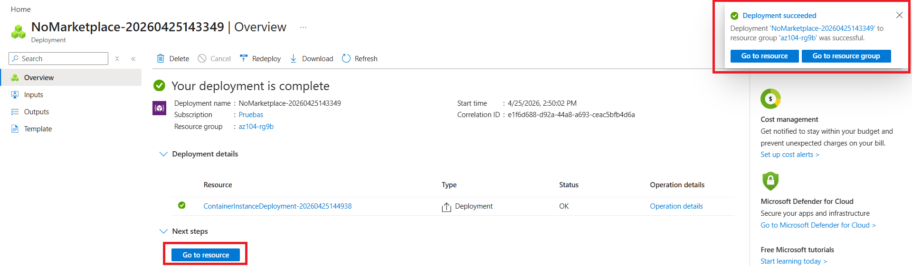
   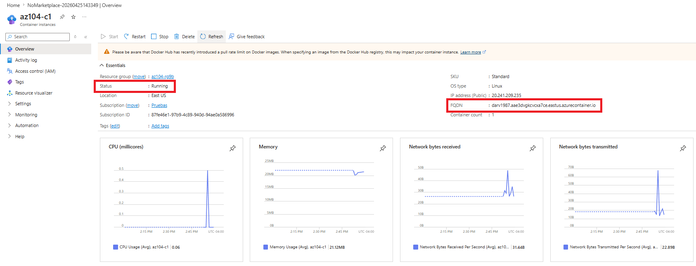

2. Copia el **FQDN** → ábrelo en el navegador → verifica **Welcome to Azure Container Instance**

   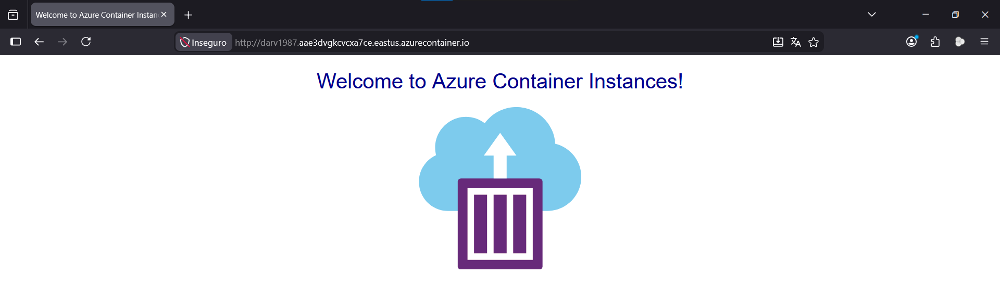

3. **Settings → Containers → Logs** → verifica las entradas HTTP GET

   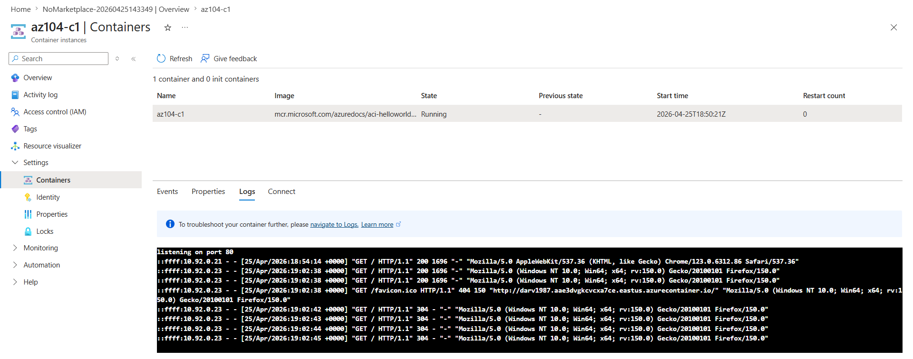

### Método B — CLI

```powershell
# Estado del contenedor
az container show --name "az104-c1" --resource-group "az104-rg9" --query "{Status:instanceView.state, FQDN:ipAddress.fqdn}" --output table

# Logs
az container logs --name "az104-c1" --resource-group "az104-rg9"
```

**Resultado esperado:**
> Los logs muestran peticiones HTTP GET confirmando que la aplicación está respondiendo a las visitas del navegador.

---

## ⚠️ Errores comunes

### Error 1 — DNS label ya está en uso

**Síntoma:** Error `DnsNameAlreadyInUse` al crear el contenedor.

**Causa:** El DNS label debe ser único globalmente en la región.

**Solución:** Añade un sufijo aleatorio al nombre, como `az104-c1-<random>`.

---

### Error 2 — El contenedor aparece como `Terminated`

**Síntoma:** El contenedor se despliega pero pasa a estado Terminated inmediatamente.

**Causa:** La imagen no puede iniciarse (error en el entrypoint) o hay un conflicto de puertos.

**Solución:**
```powershell
# Ver eventos del contenedor
az container show --name "az104-c1" --resource-group "az104-rg9" --query "containers[0].instanceView.events" --output table
```

---

## 🧹 Limpieza de recursos

### Método A — Portal

`az104-rg9` → **Eliminar grupo de recursos**

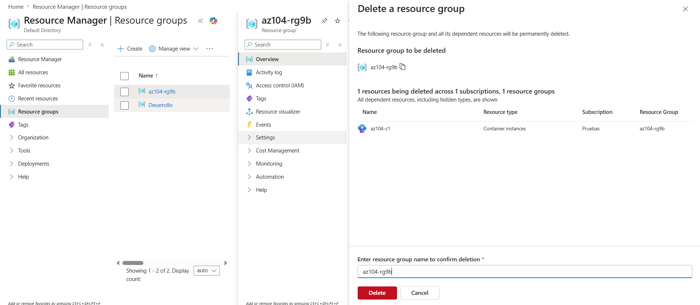

### Método B — CLI

```powershell
az group delete --name "az104-rg9" --yes --no-wait
```

---

## 💰 Costo real documentado

| Concepto | Duración | Costo |
|----------|----------|-------|
| 1 vCPU | ~15 min (0.25h) | ~$0.012 |
| 1.5 GB RAM | ~15 min (0.25h) | ~$0.002 |
| **Total lab** | | **~$0.014** |

**Fecha de ejecución:** [VERIFICAR COSTO — completar al ejecutar]
**Región:** East US

---

## 📊 Análisis FinOps rápido

| Concepto | Azure | AWS | GCP | OCI |
|----------|-------|-----|-----|-----|
| Contenedores serverless | ACI | ECS Fargate | Cloud Run | Container Instances |
| Facturación | Por segundo (CPU+RAM) | Por segundo | Por solicitud + CPU | Por segundo |
| Costo 1vCPU 1h | $0.049 | $0.044 | $0.024 | $0.014 |
| Costo 1GB RAM 1h | $0.005 | $0.005 | $0.003 | $0.002 |

**¿Cuándo usar ACI vs App Service vs AKS?**
> ACI: tareas batch, jobs ocasionales, contenedores efímeros sin estado. App Service: aplicaciones web con ciclo de vida gestionado, slots, autoscaling HTTP. AKS: microservicios complejos que necesitan orquestación, service mesh o cargas persistentes.

---

## 📝 Resumen y siguiente lab

**Lo que aprendiste en este lab:**
- ACI elimina completamente la gestión de infraestructura — solo pagas mientras el contenedor existe
- La facturación es por segundo, lo que hace ACI ideal para cargas esporádicas o demos
- Los logs del contenedor son accesibles directamente desde el portal sin configuración adicional

**Siguiente lab recomendado:**
👉 [Lab 09c — Azure Container Apps](../../Lab-09c-AKS/lab-base/README.md)

---

*Lab documentado por el proyecto [RoadmapMultiCloud-ES](../../../../../../README.md)*
*Licencia: [CC BY-NC-SA 4.0](../../../../../../LICENSE)*
