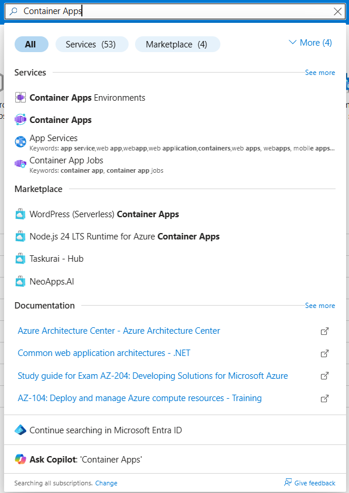
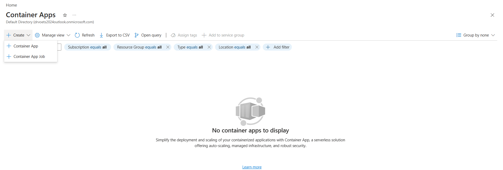
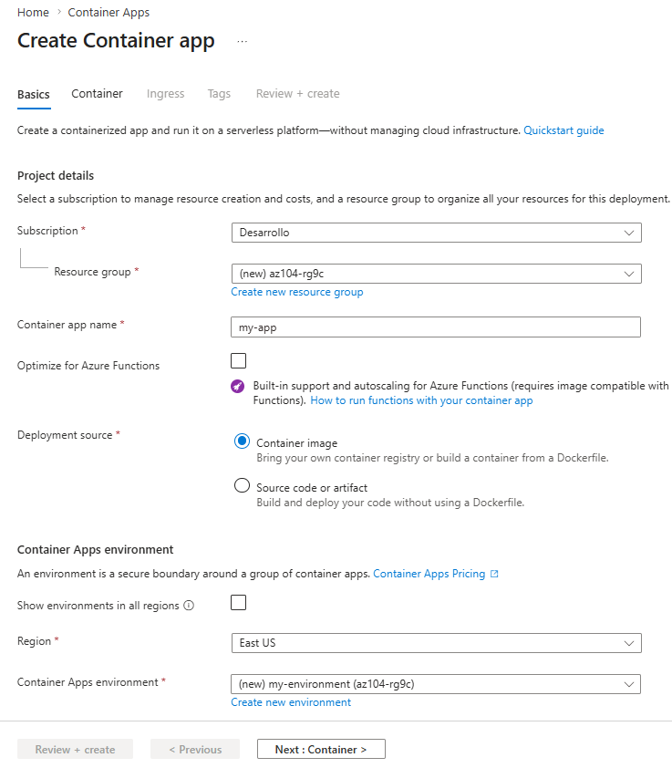
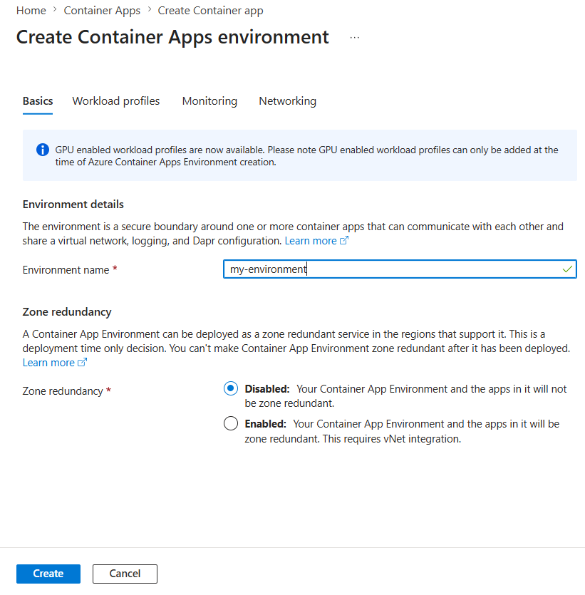
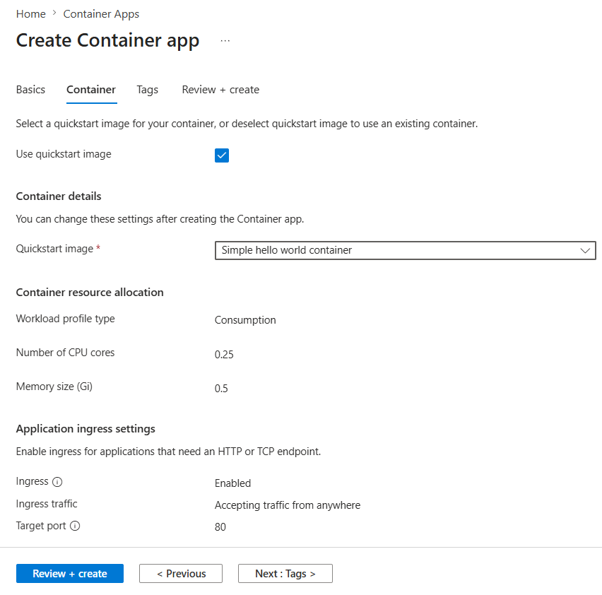
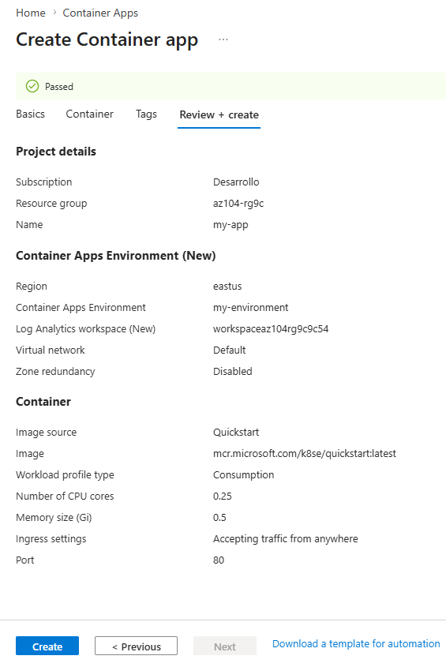
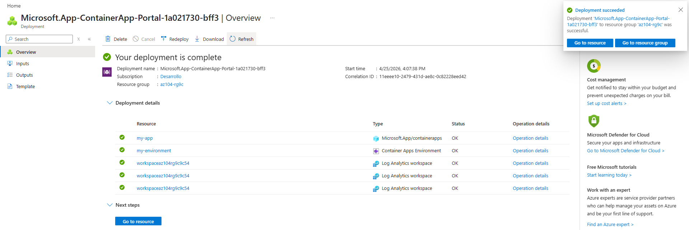
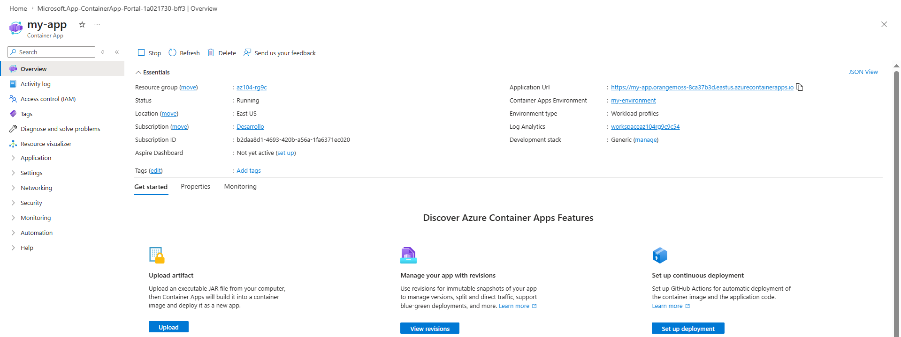
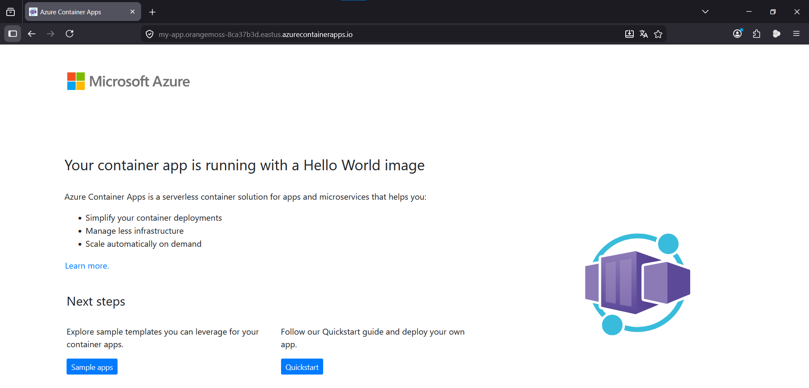
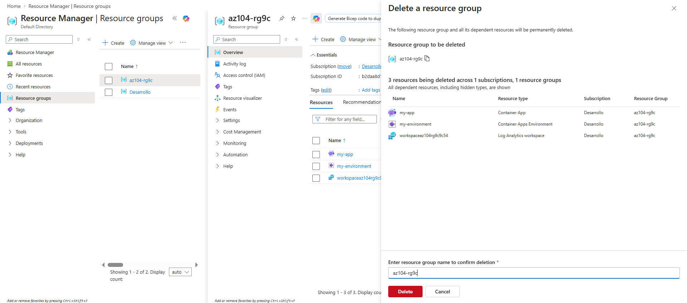

# Azure Container Apps — Lab 09c

> Fase: F2 | Cert: AZ-104 | Lab: 09c | Tipo: base

---
**Fase:** F2 — Administración
**Certificación:** AZ-104
**Lab número:** 09c
**Tipo:** base
**Última actualización:** 2026-05
**Costo real documentado:** ~$0.03 USD (1 vCPU + 2GB RAM × 15 min)
**Región usada:** East US
**Duración estimada:** 15 minutos

---

## 📋 Índice

- [Objetivos](#objetivos)
- [Prerequisitos](#prerequisitos)
- [Servicios utilizados](#servicios-utilizados)
- [Arquitectura del lab](#arquitectura-del-lab)
- [Tarea 1 — Crear Container App y entorno](#tarea-1)
- [Tarea 2 — Verificar el despliegue](#tarea-2)
- [Errores comunes](#errores-comunes)
- [Limpieza de recursos](#limpieza-de-recursos)
- [Costo real](#costo-real-documentado)
- [Análisis FinOps rápido](#análisis-finops-rápido)
- [Resumen y siguiente lab](#resumen-y-siguiente-lab)

---

## 🎯 Objetivos

Al completar este lab serás capaz de:

- [ ] Crear un entorno de Container Apps y desplegar una aplicación containerizada
- [ ] Entender la diferencia entre ACI (Lab-09b) y Container Apps en términos de gestión y escalado
- [ ] Verificar el acceso público a la aplicación via URL generada automáticamente

**Habilidades del examen que cubre este lab:**
> **Deploy and manage Azure compute resources (20–25%)**
> — Configure Azure Container Apps

---

## ✅ Prerequisitos

**Labs anteriores recomendados:**
- [ ] Lab 09b — ACI *(comparativa directa con ACI)*

**Conocimientos previos:**
- ACA vs ACI: ACA gestiona el entorno del cluster Kubernetes subyacente además del contenedor — ACI solo gestiona el contenedor individual
- ACA incluye: escalado automático basado en HTTP/KEDA, revisiones, tráfico split, Dapr integrado

---

## 🛠️ Servicios utilizados

| Servicio | Propósito en este lab | Costo aprox. |
|----------|----------------------|--------------|
| Container Apps Environment | Entorno compartido del cluster | Incluido |
| Azure Container App | Aplicación Hello World | $0.000024/vCPU-segundo |
| DNS público automático | URL de acceso | $0.00 |

---

## 🏗️ Arquitectura del lab

```
Container Apps Environment: my-environment
│
└── Container App: my-app
    ├── Image: mcr.microsoft.com/k8se/quickstart:latest
    ├── Port: 80
    ├── Ingress: External (público)
    └── URL: https://my-app.<hash>.eastus.azurecontainerapps.io
```

**Lo que construimos en este lab:**
Una Container App accesible públicamente. A diferencia de ACI, el entorno de Container Apps gestiona el cluster Kubernetes subyacente, habilitando escalado automático a cero instancias cuando no hay tráfico.

---

## Tarea 1 — Crear Container App y entorno

**Objetivo de la tarea:** Crear el entorno (equivalente al cluster Kubernetes administrado) y desplegar la primera Container App en él.

### Método A — Portal web

1. Portal → **Container Apps** → **+ Crear** → **Container App**

   
   

2. Configura **Basics**:
   - **RG:** `az104-rg9` | **Name:** `my-app` | **Region:** East US
   - **Container Apps Environment:** **Create new** → nombre: `my-environment` → **Create**

   
   

3. Pestaña **Container** → verifica **Use quickstart image** marcado

   

4. **Review + create** → **Create** → espera 2-3 minutos

   
   

### Método B — CLI

```powershell
az group create --name "az104-rg9" --location "eastus"

# Crear entorno
az containerapp env create `
  --name "my-environment" `
  --resource-group "az104-rg9" `
  --location "eastus"

# Crear Container App
az containerapp create `
  --name "my-app" `
  --resource-group "az104-rg9" `
  --environment "my-environment" `
  --image "mcr.microsoft.com/k8se/quickstart:latest" `
  --target-port 80 `
  --ingress "external" `
  --query "properties.configuration.ingress.fqdn"
```

**Resultado esperado:**
> Container App desplegada con URL pública `https://my-app.<hash>.eastus.azurecontainerapps.io`.

---

## Tarea 2 — Verificar el despliegue

**Objetivo de la tarea:** Confirmar que la aplicación es accesible públicamente y muestra el mensaje de bienvenida.

### Método A — Portal web

1. **Go to resource** → copia el **Application URL**

   

2. Navega a la URL → verifica **Your Azure Container Apps app is live**

   

### Método B — CLI

```powershell
# Obtener la URL de la aplicación
$url = az containerapp show --name "my-app" --resource-group "az104-rg9" --query "properties.configuration.ingress.fqdn" --output tsv
Write-Host "URL: https://$url"
Invoke-WebRequest -Uri "https://$url" -UseBasicParsing | Select-Object StatusCode
```

**Resultado esperado:**
> La URL muestra "Your Azure Container Apps app is live" — la aplicación está disponible públicamente.

---

## ⚠️ Errores comunes

### Error 1 — El environment tarda más de 5 minutos en crearse

**Síntoma:** La operación de creación del entorno se demora.

**Causa:** El entorno provisiona un cluster Kubernetes administrado en background — es normal que tarde 3-5 minutos.

**Solución:** Esperar. Si pasa de 10 minutos, cancelar y repetir en otra región.

---

## 🧹 Limpieza de recursos

### Método A — Portal

`az104-rg9` → **Eliminar grupo de recursos**



### Método B — CLI

```powershell
az group delete --name "az104-rg9" --yes --no-wait
```

---

## 💰 Costo real documentado

| Concepto | Duración | Costo |
|----------|----------|-------|
| 1 vCPU activo | ~15 min | ~$0.022 |
| 2 GB RAM | ~15 min | ~$0.003 |
| **Total lab** | | **~$0.025** |

**Fecha de ejecución:** [VERIFICAR COSTO — completar al ejecutar]
**Región:** East US

---

## 📊 Análisis FinOps rápido

| Concepto | Azure | AWS | GCP | OCI |
|----------|-------|-----|-----|-----|
| Contenedores serverless gestionados | Container Apps | ECS Fargate | Cloud Run | Container Instances |
| Escalado a cero | Sí | Sí | Sí | No |
| Orquestación subyacente | Kubernetes | ECS | Kubernetes | No |
| KEDA integrado | Sí | No (manual) | Sí (Knative) | No |

**ACI vs Container Apps vs AKS:**
> ACI para contenedores individuales sin estado. Container Apps cuando necesitas escalado a cero, revisiones, traffic splitting o KEDA sin gestionar Kubernetes. AKS cuando necesitas control total del cluster, networking avanzado o workloads con estado.

---

## 📝 Resumen y siguiente lab

**Lo que aprendiste en este lab:**
- Container Apps abstrae completamente Kubernetes — no ves nodos, pods ni namespaces
- El escalado a cero (scale-to-zero) reduce el costo a $0 cuando no hay tráfico
- El entorno es el recurso compartido que actúa como cluster — múltiples apps comparten el mismo entorno

**Siguiente lab recomendado:**
👉 [Lab 10 — Data Protection y Backup](../../Lab-10-Backup/lab-base/README.md)

---

*Lab documentado por el proyecto [RoadmapMultiCloud-ES](../../../../../../README.md)*
*Licencia: [CC BY-NC-SA 4.0](../../../../../../LICENSE)*
